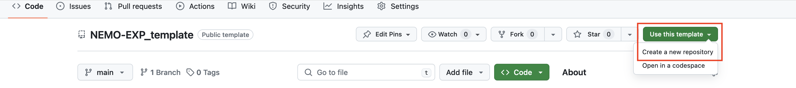

Morays Collections
==================

.. toctree::
   :maxdepth: 2

To reproduce a Morays expriment, follow this `tutorial <https://morays-doc.readthedocs.io/en/latest/getting_started.html>`_.

Contribute
----------

Contributions to Morays collection with new use cases are welcome.

You can contribute in two ways:
    1. Create a whole new use case by creating a repository containing all experiment material
    2. Add a variation of an existing experiment in the corresponding repository

New experiment
~~~~~~~~~~~~~~

**1. Create a new repository.**

All Morays use cases are stored in separate repositories. Those are named with a simple convention ``<OCEAN_CODE>-<EXPERIMENT>`` and must be structured and filled in accordance with Morays norms.

Repository templates for each code are provided to help you:
    - `NEMO template <https://github.com/morays-community/NEMO-EXP_template>`_
    - CROCO template (not started yet)

Choose the template corresponding to the code with which you performed your test case. Click on "Use this template" green button and choose "Create a new repository." Name it with the abovementioned convention.

Note that the repository contains a ``README`` and pre-defined directories.

**2. Inform about environemnt**

``README`` file of the repository is here to give informations on the scientific and software environments. Simply follow the instructions given in the ``README`` to fill it.

Requirements section of the ``README`` is the most important because it indicates what softwares to use. Potential patches and adjustments must be described here to ensure reproducibility.

Software requirements may be sorted in four categories:
    - **Compilation:** ocean code version to compile and with which potential additionnal material
    - **Python:** Eophis version to install and potential additional Python material
    - **Run:** submission tools to manage the experiment execution
    - **Post-Process:** post-processing libraries and plotting tools

Do no hesitate to add more requirements if necessary.

**3. Fill experiment directory**

The experiment itself is stored in the main directory of the repository. You can provide any material you want for your test case. The only condition is that it must be sorted between the following directories:

- **CONFIG** : material for code compilation (custom sources, makefile, CPP keys...)
- **INFERENCES** : Python and Eophis material (links to ML model repo)
- **RUN** : material for production (namelists, I/O files, submission scripts...)
- **POSTPROCESS** : material for post-processing and plotting
- **RES** : some pertinent results

Feel free to get inspired from already existing experiments.

Create a variation
~~~~~~~~~~~~~~~~~~

A variation of an experiment is another experiment that shares the same software and scientific environments. The variation is stored in the same repository, but in a new main directory. Naming convention of the new directory is: ``<EXPERIMENT>.<VARIATION>``

Material for the variation must be sorted as described above.

NEMO experiments
----------------

This is a quick summary of the NEMO experiments hosted in the Morays project.

NEMO-DINO
~~~~~~~~~
Idealized NeverwOrld config coupled with different ML models : `NEMO-DINO <https://github.com/morays-community/NEMO-DINO>`_

NEMO-Subgrid_Density
~~~~~~~~~~~~~~~~~~~~
1/4deg global ocean circulation with Python subgrid-density closures : `NEMO-Subgrid_Density <https://github.com/morays-community/NEMO-Subgrid_Density>`_

NEMO-MLE_Fluxes
~~~~~~~~~~~~~~~
1/4deg global ocean circulation with submesoscales Mixed Layer Eddies closures : Private, ask for an access.

CROCO experiments
-----------------

.. warning :: Coming soon !
