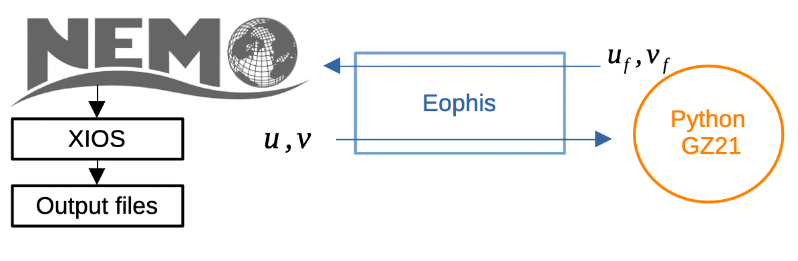

Getting started
===============

.. toctree::
   :maxdepth: 2

In this tutorial, we will deploy a Morays experiment for NEMO that is stored in the Morays collection. Objective of the experiment is to couple the ML model proposed by `Guillaumin and Zanna, 2021 <https://doi.org/10.1029/2021MS002534>`_ (GZ21) with the `DINO <https://github.com/vopikamm/DINO>`_ config.

Prerequisites to the turorial:
    - Operating NEMO compilation environment (see `NEMO doc <https://sites.nemo-ocean.io/user-guide/install.html>`_ for help)
    - Operating Python environment
    - Operating computing environment

Introduction
------------

DINO stands for `diabatic Neverworld2 <https://gmd.copernicus.org/articles/15/6567/2022/>`_ . It's an idealized configuration that aims to capture essential pole-to-pole ocean dynamics for mesoscale turbulence study.

The work of GZ21 takes place in the context of parameterizing the ocean subgrid momentum forcing with a ML model. The goal is to predict the mean and standard deviation of a Gaussian probability distribution at each grid cell. Those are intended to be used for a stochastic prediction of the subgrid forcing. We wish to use the GZ21 parameterization to enhance the solution of a DINO simulation. The model relies on a CNN that takes macroscale surface velocities as inputs and returns mean and deviation as outputs.

Here is the difficulty: the CNN model is written with native Python libraries while NEMO is written in Fortran. Thus, an interface is required to make both to coexist and exchange data. Since NEMO has an OASIS interface, we can use the Eophis library to couple an external Python script that will contain the GZ21 model.

The experiment will execute the following steps:
    - NEMO is modeling the DINO ocean circulation
    - It sends the surface velocity fields towards the Python script every time step
    - GZ21 model in Python script predicts the mean and standard deviation and the forcing fields
    - Results are sent back to NEMO and written in an output file with XIOS
    - Forcing fields are finally used to parameterize the subgrid momentum

1. Morays environment
---------------------

Every Morays experiments with NEMO require a couple of shared libraries. We quickly summarize the steps to install them.

Compile OASIS_v5.0
~~~~~~~~~~~~~~~~~~

OASIS is the coupling library on which both NEMO and Eophis rely to perform field exchanges. OASIS_v5.0 is the minimal required version and must be dynamically compiled. See `OASIS documentation <https://oasis.cerfacs.fr/en/documentation/>`_ for more details.

.. code-block:: bash

    # Clone OASIS_v5.0
    cd ~/
    git clone https://gitlab.com/cerfacs/oasis3-mct.git
    cd ~/oasis3-mct
    git checkout OASIS3-MCT_5.0
    cd util/make_dir
    
Edit your own ``make.<YOUR_MACHINE>`` file. Be sure to have the following flags defined for dynamic compilation:

.. code-block:: bash

     DYNOPT = -fPIC
     LDDYNOPT = -shared

.. code-block:: bash
    
    # Link your architecture file for compilation
    echo "include ~/oasis3-mct/util/make_dir/make.<YOUR_MACHINE>"  >  make.inc
     
    # Compile dynamic libraries
    make -f TopMakefileOasis3 pyoasis
    

.. note :: In the following, we will compile NEMO with OASIS. Just keep in mind where OASIS_v5.0 dynamic libraries are stored. Let's assume for the tutorial that they are at this location:

    .. code-block :: bash
    
        ls ~/oasis3-mct/BLD/lib/
        libmct.so   libmpeu.so   liboasis.cbind.so   libpsmile.MPI1.so   libscrip.so

Compile XIOS
~~~~~~~~~~~~

XIOS is used by NEMO to write results. It must be compiled with the abovementioned OASIS libraries. See `XIOS documentation <https://forge.ipsl.jussieu.fr/ioserver/wiki/documentation>`_ for more details about compilation of XIOS with OASIS.

.. code-block:: bash

    # Clone XIOS
    cd ~/
    svn co http://forge.ipsl.jussieu.fr/ioserver/svn/XIOS2/trunk xios_oasis_5.0
    cd ~/xios_oasis_5.0/

Edit your ``arch-<YOUR_MACHINE>.path`` file to include the OASIS libraries directories and bindings:

.. code-block:: bash

    # edit arch files
    vi archs/arch-<YOUR_MACHINE>.path
        # ...
        OASIS_INCDIR="-I~/oasis3-mct/BLD/include/ -I~/oasis3-mct/BLD/build-shared/lib/cbindings/"
        OASIS_LIBDIR="-L~/oasis3-mct/BLD/lib"
        OASIS_LIB="-loasis.cbind -lpsmile.MPI1 -lscrip -lmct -lmpeu"

.. code-block:: bash

    # Compile
    ./make_xios --full --prod --arch <YOUR_MACHINE> --use_oasis oasis3_mct

    # library should be here
    ls lib/
    libxios.a

2. Experiment environment
-------------------------

Now that we have set up the common environment for all Morays experiments, we need to install the dependencies related to the specific experiment of interest. Let's find it in the `Morays repositories <https://github.com/orgs/morays-community/repositories>`_. Those are named with a simple convention: ``<OCEAN_CODE>-<EXPERIMENT>``. The corresponding repository for the tutorial is then ``NEMO-DINO``. We clone the tutorial branch:

.. code-block:: bash

    cd ~/
    git clone -b morays_tuto https://github.com/morays-community/NEMO-DINO.git

The repository contains a ``README`` with informations about experiment context and motivations.

The other informations listed in ``README`` are the software requirements:
    - **Compilation:** ocean code version to compile and with which potential additionnal material
    - **Python:** Eophis version to install and potential additional Python material
    - **Run:** submission tools to manage the experiment execution
    - **Post-Process:** post-processing libraries and plotting tools

In accordance with the ``README`` content, we must install *NEMO_v4.2.1* and *Eophis_v1.0.0*. Other tools and scripts are already contained in the repository.

.. code-block:: bash

    # Clone NEMO_v4.2.1
    cd ~/
    git clone --branch 4.2.1 https://forge.nemo-ocean.eu/nemo/nemo.git nemo_v4.2.1
    
    # Clone Eophis_v0.9.2
    cd ~/
    git clone --branch v1.0.0 https://github.com/meom-group/eophis eophis_v1.0.0
    
See `Eophis documentation <https://eophis.readthedocs.io/en/latest/install.html>`_ for more help about installation. We will now browse the directories of the ``DINO.GZ21`` experiment to deploy the test case.

.. code-block:: bash

    ls ~/NEMO-DINO/DINO.GZ21/
    CONFIG  INFERENCES  POST-PROCESS  RES  RUN

3. CONFIG - NEMO case
---------------------

This directory contains the material to compile NEMO. Since the **Compilation** section of the ``README`` did not mention any specific tool for the compilation, we will follow the standard NEMO `configuration structure <https://sites.nemo-ocean.io/user-guide/install.html#preparing-an-experiment>`_. We first need to create a custom test case:

.. code-block:: bash

    # Create NEMO test case
    echo "DINO_GZ21 OCE" >> ~/nemo_v4.2.1/tests/work_cfgs.txt
    mkdir -p ~/nemo_v4.2.1/tests/DINO_GZ21/EXPREF
    mkdir -p ~/nemo_v4.2.1/tests/DINO_GZ21/MY_SRC

A list of active CPP keys is given as material in the CONFIG directory. Let's use it:
    
.. code-block:: bash

    # Copy CPP keys
    cp ~/NEMO-DINO/DINO.GZ21/CONFIG/cpp_DINO_GZ21.fcm   ~/nemo_v4.2.1/tests/DINO_GZ21/

An architecture file is of course compulsory to compile NEMO. A template for the experiment is also given in CONFIG. Depending on your local hardware environment, it might not be not suitable. Feel free to copy and edit it in accordance with your machine. Alternatively, the automatic generation may be used:

.. code-block:: bash

    cd ~/nemo_v4.2.1/arch
    ./build_arch-auto.sh
    cp arch-auto.fcm arch-X64_DINO_GZ21.fcm
    

Regardless of the method you chose, be sure to have your architecture file copied in ``~/nemo_v4.2.1/arch/`` and to have the OASIS and XIOS paths corresponding to those compiled with OASIS_v5.0 libraries:

.. code-block:: bash

    # XIOS and OASIS path
    vi ~/NEMO-DINO/DINO.GZ21/CONFIG/arch-X64_DINO_GZ21.fcm
    # [...]
    %XIOS_HOME          ~/xios_oasis_5.0
    %OASIS_HOME         ~/oasis3-mct/BLD

Morays patch
~~~~~~~~~~~~

``README`` mentionned that the  NEMO sources must be patched with Morays sources. Those are the minimal NEMO sources modifications to set up a Morays experiment. They enable flexible external communication through the OASIS module. We can obtain them by cloning this repository:

.. code-block:: bash

    cd ~/
    git clone https://github.com/morays-community/Patches-NEMO.git

We transfer now the Morays sources for NEMO_v4.2.1 to our custom test case. Only the sources of the OCE module are needed:

.. code-block:: bash

    # Copy Morays sources
    cp ~/Patches-NEMO/NEMO_v4.2.1/OCE/*   ~/nemo_v4.2.1/tests/DINO_GZ21/MY_SRC/

Experiment patch
~~~~~~~~~~~~~~~~

``README`` also specified to patch NEMO with the experiment specific sources. Morays sources do not configure the external communication module in accordance with ``DINO.GZ21`` but experiment sources do. They also contain the code to write and use the outsourced forcing fields. They are also stored in CONFIG:

.. code-block:: bash

    # Copy experiment sources
    cp ~/NEMO-DINO/DINO.GZ21/CONFIG/my_src/*   ~/nemo_v4.2.1/tests/DINO_GZ21/MY_SRC/

4. RUN - NEMO settings
----------------------

This directory contains all the production material, such as XIOS configuration files and NEMO namelists. We need them obviously:

.. code-block:: bash
    
    # Copy xml files and namelists
    cp ~/NEMO-DINO/DINO.GZ21/RUN/NAMELISTS/*   ~/nemo_v4.2.1/tests/DINO_GZ21/EXPREF/
    cp ~/NEMO-DINO/DINO.GZ21/RUN/XML/*   ~/nemo_v4.2.1/tests/DINO_GZ21/EXPREF/

We have now everything we need to compile NEMO and deploy the config:

.. code-block:: bash

    cd ~/nemo_v4.2.1
    ./makenemo -m "X64_DINO_GZ21" -a DINO_GZ21 -n "MY_DINO_GZ21" -j 8

In RUN directory is also contained the execution material for the experiment. Except ``job.ksh``, no particular tool to manage the run is specified in ``README``:

.. code-block:: bash
    
    cp ~/NEMO-DINO/DINO.GZ21/RUN/job.ksh   ~/nemo_v4.2.1/tests/MY_DINO_GZ21/EXP00/

Script ``job.ksh`` assumes that NEMO will run on a HPC system via a SBATCH scheduler. Adapt script content or remove SBATCH header if necessary.

5. INFERENCES - Python material
-------------------------------

This directory contains the Python scripts for hybrid modeling. It also includes additional packages for the Python model (if necessary). Here, GZ21 model sources and its dependencies are contained in a git submodule ``gz21_ocean_momentum``. The model is imported and used in accordance with the experiment objectives in ``ml_models.py``. Finally, ``main.py`` contains the Eophis instructions to couple ``ml_models.py`` with NEMO.  Let's copy them to the test case:

.. code-block:: bash

    cp ~/NEMO-DINO/DINO.GZ21/INFERENCES/*.py   ~/nemo_v4.2.1/tests/MY_DINO_GZ21/EXP00/
    
    
Model weights are in the folder of the same name. For this tutorial, we will use those:
    
.. code-block:: bash

    cp ~/NEMO-DINO/DINO.GZ21/INFERENCES/weights/gz21_huggingface/low-resolution/files/trained_model.pth   ~/nemo_v4.2.1/tests/MY_DINO_GZ21/EXP00/

As a git submodule, ``gz21_ocean_momentum`` must be initialized or it will stay empty:

.. code-block:: bash

    cd ~/NEMO-DINO/
    git submodule update --init --recursive

It is now up-to-date with the original GZ21 repository and contains the package sources. We need to install it with its dependencies:

.. code-block:: bash

    cd ~/NEMO-DINO/DINO.GZ21/INFERENCES/gz21_ocean_momentum/
    pip install -e .

GZ21 model may be tested by running ``ml_models.py`` as a standalone script:

.. code-block:: bash

    cd ~/NEMO-DINO/DINO.GZ21/INFERENCES/
    python3 ./ml_models.py
    # Should print "Test successful"
        
    

6. Running the experiment
-------------------------

Everything is ready to execute the hybrid experiment. Submit the run with ``job.ksh`` in accordance with your computing environment. If you are not running NEMO on a HPC system, execute commands below inside the experiment directory:

.. code-block:: bash

    cd ~/nemo_v4.2.1/tests/MY_DINO_GZ21/EXP00/

    # clean working directory
    touch namcouple
    rm namcouple*

    # execute eophis in preproduction mode to generate namcouple
    python3 ./main.py --exec preprod
    
    # save eophis preproduction logs
    mv eophis.out eophis_preprod.out
    mv eophis.err eophis_preprod.err
    
    # run coupled NEMO-Python
    mpirun -np 1 ./nemo : -np 1 python3 ./main.py --exec prod

If run is going well, Eophis log should contain messages like these:

.. code-block:: bash

    tail eophis.out
    Iteration 2: 2700s -- 0:45:00
       Treating u, v received through tunnel TO_NEMO_FIELDS
       Sending back u_f, v_f through tunnel TO_NEMO_FIELDS
    Iteration 3: 5400s -- 1:30:00
       Treating u, v received through tunnel TO_NEMO_FIELDS
       Sending back u_f, v_f through tunnel TO_NEMO_FIELDS
    Iteration 4: 8100s -- 2:15:00
       Treating u, v received through tunnel TO_NEMO_FIELDS
       Sending back u_f, v_f through tunnel TO_NEMO_FIELDS
    Iteration 5: 10800s -- 3:00:00
       Treating u, v received through tunnel TO_NEMO_FIELDS
       Sending back u_f, v_f through tunnel TO_NEMO_FIELDS

This means that the exchanges are well performed. Check out also that output files ``NEVERWORLD.1d_gridUsurf.nc`` and ``NEVERWORLD.1d_gridVsurf.nc`` have been created. They contain the subgrid forcing fields computed by GZ21 model.

.. note:: If your computing environment is able to give you an access to a CUDA-compatible GPU, ``ml_models.py`` will automatically transfer the prediction execution on the GPU while NEMO and Eophis will still be executed on CPUs.

7. POST-PROCESS and RES
-----------------------

POST-PROCESS directory contains material and/or scripts to compute and plot results. Those are then stored in the RES directory to be available for consultation. In this tutorial, only a simple Python script ``plots_res.py`` is to be executed to plot figures. Required dependencies are also given.

.. code-block:: bash

    # install dependencies, if necessary
    cd ~/NEMO-DINO/DINO.GZ21/POST-PROCESS/
    pip install -r requirements.txt
    cp plots_res.py  ~/nemo_v4.2.1/tests/MY_DINO_GZ21/EXP00/
    
    # Plot figures
    cd ~/nemo_v4.2.1/tests/MY_DINO_GZ21/EXP00/
    python3 ./plots_res.py

If everything went good, we should have similar figures than those stored in RES. Same plots for a standard DINO config without GZ21 model are also stored for comparison.

As described in the introduction, NEMO only sends the surface velocities towards GZ21 model. However, the implementation allows to send the whole 3D grid if you wish. Just adapt the value of ``nn_lvl`` in the NEMO namelist.

Going further
-------------

From now on, you have an usable deployed Morays experiment for NEMO. Do not hesitate to check out and deploy other test cases to get inspired. For example, a more advanced realization of DINO.GZ21 is available on the main branch of the tutorial repository.

Here are the locations where you can play with:
    - coupling: ``infmod.f90`` for NEMO side, ``main.py`` for Python side and global settings
    - fields to exchange: ``stpmlf.f90`` and ``infmod.f90``
    - computation of forcing fields and ML model configuration: ``ml_models.py``
    - use of forcing fields: ``infmod.f90`` and any module that imports ``inffld.f90``
    - NEMO settings: namelists and xml files

 
Next sections provide more details on how to configure the NEMO external communication module, and to create a Morays experiment for NEMO from scratch.
