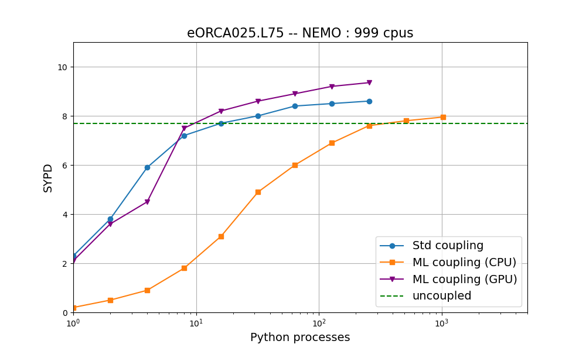
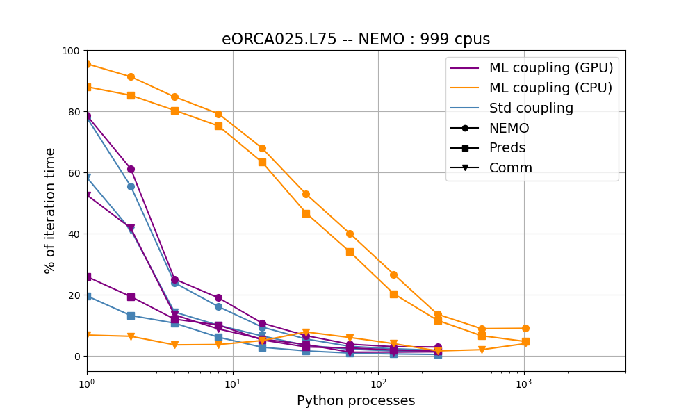

Performances
============

.. toctree::
   :maxdepth: 2

We present here some results to evaluate performances and costs of a Morays experiment for NEMO. The assessment test case is the 1/4deg global ocean circulation `NEMO-MLE_Fluxes <https://github.com/morays-community/NEMO-MLE_Fluxes>`_ test case coupled with submesoscale Mixed Layer Eddies closures. Only the first out of the 75 ocean grid levels is exchanged.

Number of processes allocated to NEMO is fixed while number of processes for Python scripts varies. Results are shown for coupling with a standard CPU analytical model, a CPU ML model, and a GPU ML model. Performances for a standard NEMO config without coupling is also shown for comparison.

Simulation speed
----------------

This figure shows the number of Simulated Year Per Day (SYPD). Without surprises, it is seen that the addition of the coupling context causes the simulation speed to fall in every cases. Fortunately, this loss can be easily balanced by allocating more processes to the Python scripts. For a standard analytical model, around 1% of the ressources allocated to NEMO is sufficient to recover performance equivalent to the uncoupled case. On the other hand, the additional cost incurred by using the CPUs for neural networks requires more ressources to achieve acceptable performance (around 20-30% of those allocated to NEMO). Another possibility to absorb this additional cost is to run the ML model on GPUs. Indeed, performance in this case matches that of the standard analytical coupling.

   
 
 
 
Time costs
----------
 
This figure shows the average percentage of a NEMO iteration taken by different steps. Here, "NEMO" refers to the time taken by NEMO routines without coupling, "Python" is the time taken by the Python script to run the coupled model, and "OASIS" refers to the time taken by OASIS to perform the exchanges.
   
   

