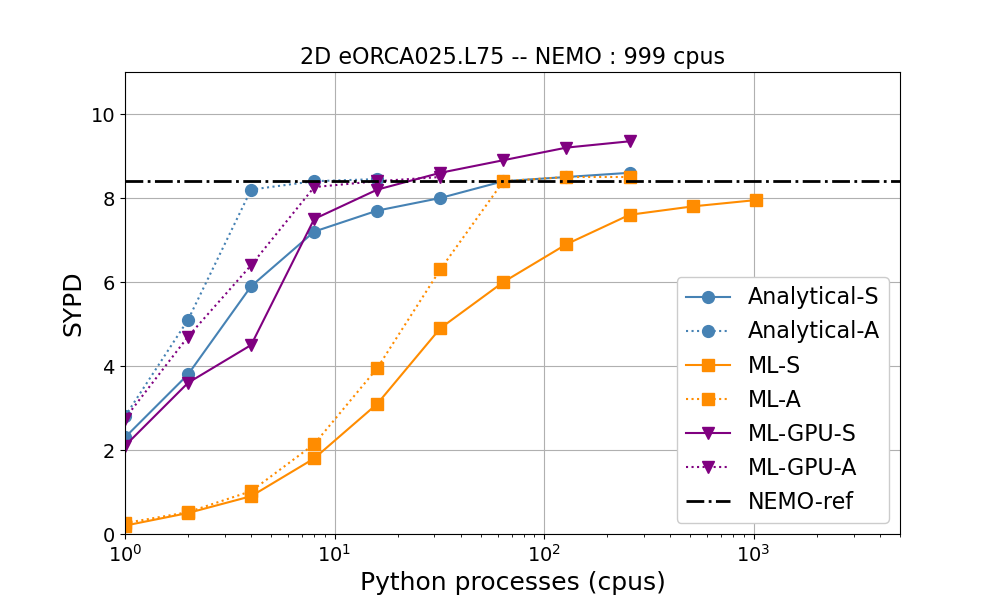
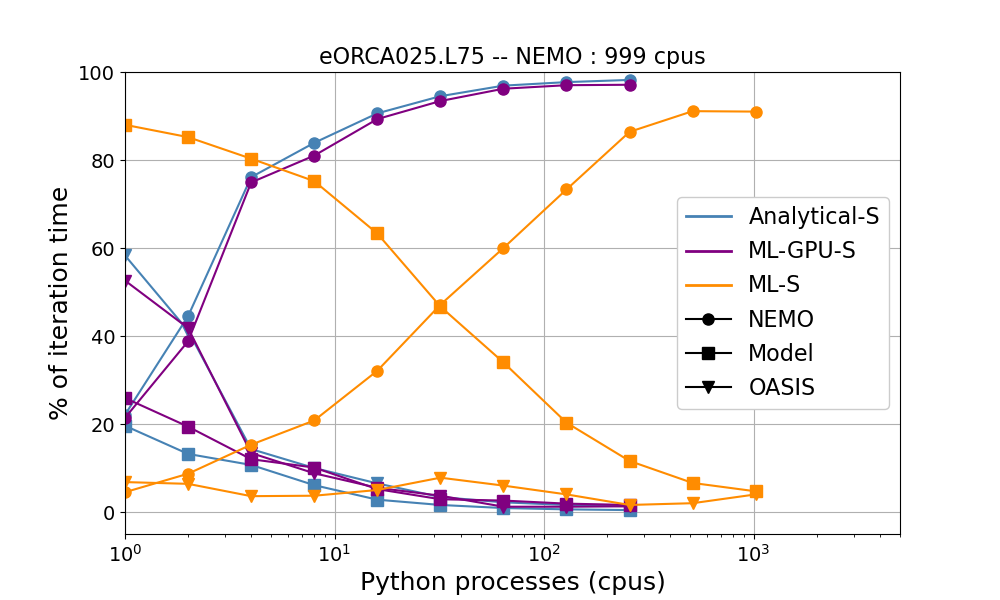

Performances
============

.. toctree::
   :maxdepth: 2

We present here the order of magnitude of performance and costs for a Morays experiment with NEMO. Assessment is performed  with the 1/4º global ocean circulation `NEMO-eORCA025_MLE <https://github.com/morays-community/NEMO-eORCA025_MLE>`_ test case, coupled with different submesoscale Mixed Layer Eddies closures. Only the first out of the 75 ocean grid levels is exchanged.

Number of CPU allocated to NEMO is fixed while number of CPU for the Python script varies. Results are shown for coupling with an analytical model, a ML model processed by the Python CPUs, and a ML model processed by GPUs (1 for 40 Python CPUs). Performances for a standard NEMO config without coupling are also shown as reference.

All test cases are executed in synchronous and asynchronous conditions. In synchronous conditions (denoted hereafter with '-S' suffix), NEMO sends the inputs, stops, and waits for Python returns. In asynchronous conditions (denoted hereafter with '-A' suffix), NEMO sends the inputs as soon as possible in the time loop, and continues computation as far as possible before to wait for Python returns.

Simulation speed
----------------

This figure shows the number of Simulated Year Per Day (SYPD). Without surprises, it is seen that the addition of the coupling context causes the simulation speed to fall in every cases compared to the reference without coupling. Fortunately, this loss can be easily balanced by allocating more processes to the Python scripts. In synchronous conditions, around 1% of the ressources allocated to NEMO are sufficient to recover performance equivalent to the reference case for the analytical model. On the other hand, the additional cost incurred by using the CPUs for neural networks requires more ressources to recover acceptable performance (around 20-30% of those allocated to NEMO). Another possibility to absorb this additional cost is to run the inferences on GPUs. Indeed, performance in this case matches that of the standard analytical coupling.

Synchronous conditions are obviously suboptimal since reducing NEMO waiting time implies to allocate more and more resources to the Python script to make its execution faster. Overlapping computation time permitted by asynchronous conditions allows to overcome this problem. Indeed, we can observe that the global resources overhead in asynchronous conditions is lower compared to the corresponding synchronous cases. It decreases to less than 1% of the resources allocated to NEMO for the analytical model and the neural network executed on GPUs. More remarkable is the resources overhead for neural network executed on CPUs that falls to around 4-8% of the resources allocated to NEMO.
 
Every asynchronous cases exhibits a plateau straight after a discontinuity. It indicates the moment where NEMO does not wait for Python anymore. Allocating resources to the Python model after this point is useless.

 
 
Time costs
----------
 
This figure shows the average percentage of a NEMO iteration taken by different steps in synchronous conditions. Here, "NEMO" refers to the time taken by NEMO routines without coupling, "Python" is the time taken by the Python script to run the model, and "OASIS" refers to the time taken by OASIS to perform communications.
   
   

