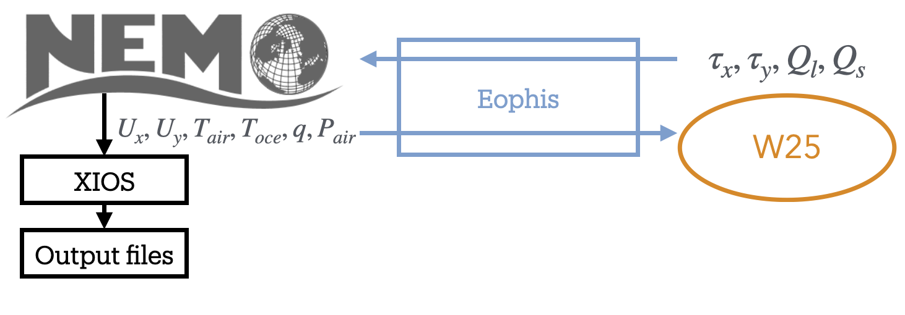
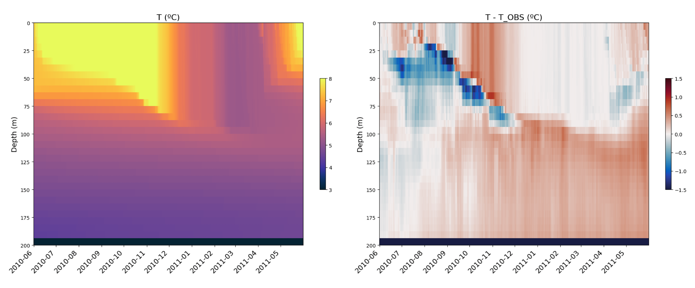
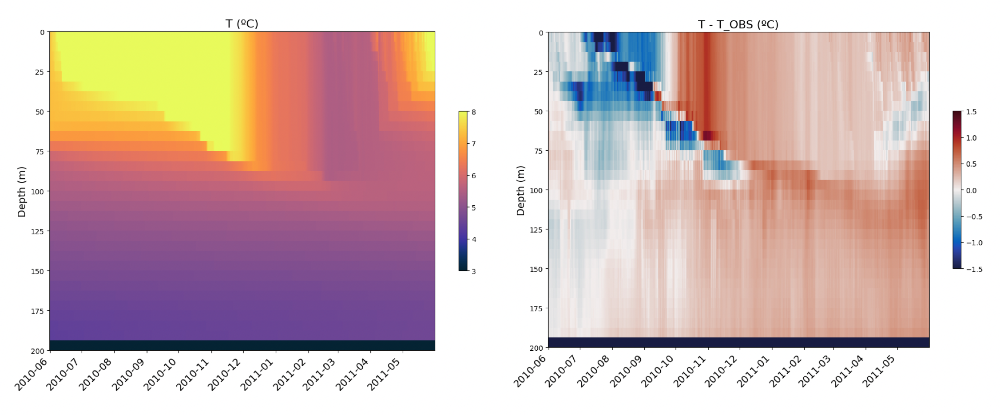

Tutorial: Create a Morays experiment for NEMO
=============================================

.. toctree::
   :maxdepth: 2

In this tutorial we will create a Morays experiment for NEMO from scratch. Objective is to deploy the ML model proposed by `Wu et al. 2025 <https://doi.org/10.48550/arXiv.2503.03990>`_ (W25) within the `C1D_PAPA <https://doi.org/10.5194/gmd-8-69-2015>`_ NEMO config.

Prerequisites to the turorial:
    - Operating NEMO environment with XIOS (see `NEMO doc <https://sites.nemo-ocean.io/user-guide/install.html>`_ for help)
    - Operating Python environment
    - Operating Morays environment (see `here <https://morays-doc.readthedocs.io/en/latest/nemo.getting_started.html#morays-environment>`_)
or:
    - Installed Apptainer
    - Morays container (see below)
    
    
**Apptainer on Linux**

.. code-block :: bash
    
    # For Ubuntu
    sudo apt update && sudo apt install -y software-properties-common
    sudo add-apt-repository -y ppa:apptainer/ppa
    sudo apt update && sudo apt install -y apptainer
    
    # For amd64 Debian
    sudo apt update
    sudo apt install -y wget
    cd /tmp
    wget https://github.com/apptainer/apptainer/releases/download/v1.4.3/apptainer_1.4.3_amd64.deb
    sudo apt install -y ./apptainer_1.4.3_amd64.deb
    
.. warning :: For other Linux distributions, please refer to this `guide <https://github.com/apptainer/apptainer/blob/main/INSTALL.md>`_.
 

**Apptainer on macOS**

.. code-block:: bash
    
    # Apptainer is available on macOS via LIMA (LInux virtual MAchines)
    brew install qemu lima  # Install with brew
    port install qemu lima  # Install with macports

    # Create Linux VM with Apptainer
    limactl start template://apptainer
    limactl shell apptainer
    # IMPORTANT: type 'cd' to go in VM home, 'pwd' should return '/home/<your_name>.linux'
    cd
    
    # NB1: copy files from VM to host
    limactl cp apptainer:/path/to/file  /host/destination
    

**Run Morays container**

.. code-block:: bash

    # Get your hardware architecture
    uname -m
    #  aarch64 --> arm64
    #  x86_64  --> amd64
    ARCH=arm64

    # Download image
    wget https://github.com/morays-community/morays-doc/releases/download/containers/morays_env_${ARCH}.sif

    # Run container: should print " >>>> Welcome in Morays environment ! <<<< "
    apptainer run --writable-tmpfs --bind $(pwd):/home/jdoe/morays_tutorial morays_env_${ARCH}.sif

        
        
Introduction
------------

C1D_PAPA is a 1D column NEMO configuration used to isolate and study vertical processes. It models turbulent-mixing behaviour over 1 year at Ocean Station PAPA, located in the North Pacific Ocean. For the tutorial, we will use a slightly modified version of the test case in which the vertical grid is regularly discretized on 32 depth levels over 200m, denoted hereafter as C1D_PAPA32.

The work of W25 takes place in the context of parameterizing air–sea fluxes with their statistically variable behavior, which is absent from deterministic bulk algorithms. The objective is to estimate the mean and variance of a stochastic process at each grid cell. These estimates are intended to be used for a stochastic prediction of momentum and heat fluxes at the ocean surface. We aim to use the W25 ML model to improve the results of a C1D_PAPA32 simulation. The model relies on an artificial neural network (ANN) that takes ocean temperature, air temperature, specific humidity, wind speed, and air pressure at ocean surface as inputs. It returns the mean and standard deviation for wind stress, latent and sensible heat fluxes.

The ANN is written with native Python libraries while NEMO is written in Fortran. Since NEMO has an OASIS interface, we can use the Eophis library to couple an external Python script that will contain the W25 model.

The final experiment will execute the following steps:
    - NEMO models turbulent mixing in the C1D_PAPA32 configuration
    - It sends the inputs variables to the Python script running W25
    - W25 model computes the mean and standard deviation of the air-sea fluxes from inputs
    - Outputs are sent back to NEMO and used for stochastic computation of air-sea fluxes
    - Results are used as surface boundary condition and written in an output file with XIOS

1. Run standard C1D_PAPA32
--------------------------

We start by running standard C1D_PAPA32 without W25. In this case, air-sea fluxes are computed with NCAR bulk formula. Get a copy of NEMO v4.2.1:

.. code-block:: bash

    # Clone NEMO
    mkdir -p ~/morays_tutorial
    cd ~/morays_tutorial
    git clone --branch 4.2.1 https://forge.nemo-ocean.eu/nemo/nemo.git nemo_v4.2.1

Inputs, config material and arch file for C1D_PAPA32 are accessible in this repository:
    
.. code-block:: bash

    # Clone C1D_PAPA32
    cd ~/morays_tutorial/nemo_v4.2.1/cfgs/
    git clone https://github.com/alexis-barge/C1D_PAPA32.git

Build config:
    
.. code-block:: bash

    # Create C1D_PAPA32 test case
    cd ~/morays_tutorial/nemo_v4.2.1
    echo "C1D_PAPA32 OCE" >> cfgs/work_cfgs.txt
    
    # Compile -- adapt arch file if you are not running Morays container
    cp cfgs/C1D_PAPA32/arch-C1D_PAPA32_GCC.fcm   arch/
    ./makenemo -m "C1D_PAPA32_GCC" -r C1D_PAPA32 -j 3
    
    
and run NEMO:

.. code-block:: bash

    cd ~/morays_tutorial/nemo_v4.2.1/cfgs/C1D_PAPA32/EXP00
    ./nemo
    
You should find netcdf files ``C1D_PAPA32_1d_20100615_20110614_grid_<T,U,V,W>.nc`` when done. Scripts to plot profiles against time are provided:
 
.. code-block:: bash
 
    # Get plotting scripts and references
    cd ~/morays_tutorial/nemo_v4.2.1/cfgs/C1D_PAPA32/EXP00
    ln -s ../PLOTS/* .
 
    # Plot, you might need to exit container (and lima VM) to visualize figures
    python3 ./plots_res.py
    python3 ./plots_diff.py
 

 
 

2. Run W25 model
----------------

We have an operating NEMO configuration. Let's focus now on the W25 model. As mentionned earlier, it must be written in an external Python script. W25 code and an implementation of the model are provided in this repository:

.. code-block:: bash

    # Clone and install W25 model
    cd ~/morays_tutorial/
    git clone https://github.com/TRACCS-COMPACT/AG2025-workshop-ocean-ml-coupling.git  W25
    cd W25/W25/W25ANN
    pip install -e .

Edit ``~/morays_tutorial/W25/W25/models.py``, a function ``W25ann()`` taking numpy arrays for all required inputs is already defined. Complete ``W25ann()`` as follows to convert the arrays into torch tensors, and pass them in the ANN to predict mean and standard deviation for the air-sea fluxes:

.. code-block:: python

        # Format inputs model
        X = np.hstack([U.reshape(-1,1), To.reshape(-1,1), Ta.reshape(-1,1),
                      rh.reshape(-1,1), p.reshape(-1,1)]).astype('float32')
        X = torch.tensor(X)

        # Predict fluxes
        M_mean = M.pred_mean(X).detach().numpy().squeeze()
        M_std = M.pred_var(X).detach().numpy().squeeze() ** 0.5
        SH_mean = SH.pred_mean(X).detach().numpy().squeeze()
        SH_std = SH.pred_var(X).detach().numpy().squeeze() ** 0.5
        LH_mean = LH.pred_mean(X).detach().numpy().squeeze()
        LH_std = LH.pred_var(X).detach().numpy().squeeze() ** 0.5

Note that stochastic fluctuations are generated after this block of code. Script ``models.py`` can be executed lonely with user-defined typical values as inputs (feel free to modify them). Run it to check that the model works correctly:

.. code-block :: bash

    python3 ./models.py
    # Should print:
    #    Res    -- taux: ...
    #    Test successful

.. note ::

    We have now an operating W25 script. However, ``models.py`` does not possess an OASIS interface and cannot be coupled with NEMO. In the next sections, we will build the Eophis scripts and configure NEMO to set up the coupling.

3. Set up coupling environment
------------------------------

Time has come to install Eophis:

.. code-block :: bash

    # Clone and install Eophis_v1.1.0
    cd ~/morays_tutorial
    git clone --branch v1.1.0 https://github.com/meom-group/eophis eophis_v1.1.0
    cd eophis_v1.1.0
    pip install .

Define the exchanges
~~~~~~~~~~~~~~~~~~~~

An Eophis script is provided in the W25 repository (``~/morays_tutorial/W25/W25/main.py``). The script may execute ``preproduction()`` or ``production()``. The first function is used to generate coupling material. The second one contains instructions to perform the coupling itself. For both, we need to define what we want to exchange in ``ocean_info()``. According to the diagram in introduction:

Eophis needs to receive from NEMO:
    - surface fields ``ux``, ``uy``, ``tair``, ``toce``, ``q``, ``p`` at each time step, on grid ``(1,1,1)``
and to send back results from W25:
    -  ``taux``, ``tauy``, ``Qs``, ``Ql`` at each time step, on grid ``(1,1,1)``

In Eophis, exchanges are defined in Tunnel. An empty Tunnel ``TO_NEMO`` (step 1) already exists:

.. code-block :: python

    tunnel_config = list()
    tunnel_config.append( { 'label' : 'TO_NEMO', \
                            'grids' : {}, \
                            'exchs' : [ {} ] }
                        )

Define the surface grid on which exchanges will be performed (i.e. 1 point grid):

.. code-block :: python

    tunnel_config = list()
    tunnel_config.append( { 'label' : 'TO_NEMO', \
                            'grids' : { 'C1D' : {'npts' : (1,1)} }, \
                            'exchs' : [ {} ] }
                        )

What remains is to define exchanges themselves. According to NEMO namelist, time step is ``1800s``. Following `Tunnel documentation <https://eophis.readthedocs.io/en/latest/usage.html#tunnel>`_, we can complete exchanges definition with:

.. code-block :: python

    tunnel_config = list()
    tunnel_config.append( { 'label' : 'TO_NEMO', \
                            'grids' : { 'C1D' : {'npts' : (1,1)} }, \
                            'exchs' : [ {'freq' : 1800, 'grd' : 'C1D', 'lvl' : 1, 'in' : ['ux','uy','toce','tair','p','q'], 'out' : ['taux','tauy','Qs','Ql']} ] }
                        )

The exchange line may be read as:

    every ``1800`` seconds, execute the receiving of field ``ux``, ``uy``, ``toce``, ``tair``, ``p``, ``q`` and the sending back of fields ``taux``, ``tauy``, ``Qs``, ``Ql`` on the first level of grid ``C1D``.

Create Tunnel object (step 2) with:

.. code-block :: python

    to_nemo, = eophis.register_tunnels( tunnel_config )

Generate OASIS material
~~~~~~~~~~~~~~~~~~~~~~~

OASIS material is generated with ``write_coupling_namelist()``, which requires total simulation time as argument. This information is available in NEMO namelist ``namelist_cfg``. The latter is read and returned by ``ocean_info()``:

.. code-block :: python

    nemo_nml = eophis.FortranNamelist('~/morays_tutorial/nemo_v4.2.1/cfgs/C1D_PAPA32/EXPREF/namelist_cfg')
    
Thus, get namelist parameters (step 3) with:
    
.. code-block :: python

    step, it_end, it_0 = nemo_nml.get('rn_Dt','nn_itend','nn_it000')
    total_time = (it_end - it_0 + 1) * step

and use them to write OASIS namelist (step 4):

.. code-block :: python

    eophis.write_coupling_namelist( simulation_time=total_time )

Eophis preproduction script is ready to be executed:

.. code-block :: bash

    python3 ./main.py --exec preprod

Four files have been created: Eophis logs ``eophis.out``, ``eophis.err``, OASIS namelist ``namcouple``, and Eophis Fortran namelist ``eophis_nml``.

Connect models
~~~~~~~~~~~~~~

We complete function ``production()`` to drive exchanges all along the run. Since the Tunnel is already created, deploy the OASIS interface (step 5) with:

.. code-block :: python

    eophis.open_tunnels()

Coupling is effective. Fields can be received and used as arguments for W25. Import it (step 6):

.. code-block :: python

    from models import W25ann
    
    
Exchanges must be synchronized in time, this is done by Loop. Loop requires a Tunnel to work with, number of time iteration, and time step value. Define Loop (step 7) as follows:

.. code-block :: python

    @eophis.all_in_all_out( geo_model=to_nemo, step=step, niter=niter )

Final step is to specify connexions between the exchanged data and W25. Connect received data, data to send and W25 in ``loop_core()`` (step 8):

.. code-block :: python

    def loop_core(**inputs):
        """
        Content of loop_core is a Router. Connexions between exchanged variables and models are defined here.
        inputs dictionnary contains variables defined in Tunnel exchanges, and received by Eophis from NEMO.
        
        """
        packed_res = W25ann( inputs['ux'], inputs['uy'], inputs['toce'], inputs['tair'], inputs['p'], inputs['q'] )

        outputs= {}
        outputs['taux'], outputs['tauy'], outputs['Qs'], outputs['Ql'] = packed_res

        return outputs

Note that all these components describe only pipelines, identified by the field names. We will now configure NEMO in accordance with the coupling environment defined by Eophis. The objective is to choose which array will be passed through OASIS along these pipelines.

4. Build C1D_PAPA32.W25
-----------------------

OASIS-built NEMO
~~~~~~~~~~~~~~~~

C1D_PAPA32.W25 models the same C1D_PAPA32 ocean circulation. Duplicate the case:

.. code-block:: bash

    # Create C1D_PAPA32.W25 test case
    cd ~/morays_tutorial/nemo_v4.2.1/cfgs
    mkdir C1D_PAPA32.W25
    echo "C1D_PAPA32.W25 OCE" >> work_cfgs.txt
    
    # Copy C1D_PAPA32 material
    cp -r C1D_PAPA32/EXPREF   C1D_PAPA32.W25/
    cp -r C1D_PAPA32/MY_SRC   C1D_PAPA32.W25/
    cp -r C1D_PAPA32/FORCING  C1D_PAPA32.W25/

and update experiment name in NEMO namelist:

.. code-block:: bash

    cd ~/morays_tutorial/nemo_v4.2.1/cfgs/C1D_PAPA32.W25/EXPREF
    vi namelist_cfg
        # ...
        cn_exp      = "C1D_PAPA32.W25" !  experience name
    
    
This configuration must be compatible with an OASIS build. OASIS interface in NEMO is activated by ``key_oasis3`` CPP key. We add it to those already used by C1D-PAPA32:

.. code-block:: bash

    # Create CPP key file
    echo " bld::tool::fppkeys   key_xios key_linssh key_oasis3" >> ~/morays_tutorial/nemo_v4.2.1/cfgs/C1D_PAPA32.W25/cpp_C1D_PAPA32.W25.fcm

OASIS and XIOS (compiled with OASIS) must be linked during NEMO compilation. Duplicate C1D_PAPA32 arch file and include them:

.. code-block :: bash

    # New arch file
    cd ~/morays_tutorial/nemo_v4.2.1/arch
    cp arch-C1D_PAPA32_GCC.fcm   arch-C1D_PAPA32_W25_GCC.fcm

    # Modify following lines: template is valid for Morays container
    vi arch-C1D_PAPA32_W25_GCC.fcm
        # ...
        %XIOS_HOME      /home/jdoe/XIOS_OASIS
        %OASIS_HOME     /home/jdoe/oasis3-mct/BLD
        # ...
        %OASIS_INC      -I%OASIS_HOME/include -I%OASIS_HOME/build-shared/lib/cbindings
        %OASIS_LIB      -L%OASIS_HOME/lib -loasis.cbind -lpsmile.MPI1 -lmct -lmpeu -lscrip
        # ...
        %USER_INC       %XIOS_INC %OASIS_INC %NCDF_INC
        %USER_LIB       %XIOS_LIB %OASIS_LIB %NCDF_LIB

Finally configure XIOS to be aware of OASIS environment:

.. code-block:: bash

    vi ~/morays_tutorial/nemo_v4.2.1/cfgs/C1D_PAPA32.W25/EXPREF/iodef.xml
        # ...
        <variable id="using_oasis"               type="bool">true</variable>

Minimal NEMO sources modifications are required to set up a hybrid Python-NEMO experiment. Those modifications are provided by Morays patch. It enables creation of independent OASIS modules. It can be obtained in this repository:

.. code-block :: bash

    # Get Morays patch
    cd ~/morays_tutorial/
    git clone https://github.com/morays-community/Patches-NEMO.git
    
We transfer Morays sources for NEMO_v4.2.1 OCE module to our case:

.. code-block :: bash

    cp ~/morays_tutorial/Patches-NEMO/NEMO_v4.2.1/OCE/*   ~/morays_tutorial/nemo_v4.2.1/cfgs/C1D_PAPA32.W25/MY_SRC/

Configure NEMO
~~~~~~~~~~~~~~

Morays patch comes with pre-defined Python communication modules ``pyfld.f90`` and ``pycpl.F90``. Edit ``pyfld.F90`` to allocate arrays where fields returned by W25 will be stored:

.. code-block :: bash

    vi ~/morays_tutorial/nemo_v4.2.1/cfgs/C1D_PAPA32.W25/MY_SRC/pyfld.F90

.. code-block :: Fortran
    
        ! Line 26
        REAL(wp), PUBLIC, ALLOCATABLE, SAVE, DIMENSION(:,:)  :: ext_qs, ext_ql, ext_taux, ext_tauy
        ! Line 46
        ALLOCATE( ext_taux(jpi,jpj), ext_tauy(jpi,jpj), ext_qs(jpi,jpj), ext_ql(jpi,jpj) )
        ! Line 65
        DEALLOCATE( ext_taux, ext_tauy, ext_qs, ext_ql )

Import communication modules in ``sbcblk.F90``, as it is the location of air-sea fluxes computation:

.. code-block :: bash
    
    cp ~/morays_tutorial/nemo_v4.2.1/src/OCE/SBC/sbcblk.F90   ~/morays_tutorial/nemo_v4.2.1/cfgs/C1D_PAPA32.W25/MY_SRC/
    vi ~/morays_tutorial/nemo_v4.2.1/cfgs/C1D_PAPA32.W25/MY_SRC/sbcblk.F90

.. code-block :: Fortran

    ! Line 44
    USE pyfld
    USE pycpl

The functions in NEMO for sending or receiving arrays to or from Python in accordance with Eophis are ``send_to_python()`` and ``receive_from_python()``, respectively. They take the field name defined in Eophis exchanges, the array to send or in which to store the results, and the current NEMO time step as arguments. Proceed sendings and receptions in ``sbcblk.F90`` with:

.. code-block :: Fortran

    ! Line 820
    CALL send_to_python('ux', pwndi, kt)
    CALL send_to_python('uy', pwndj, kt)
    CALL send_to_python('tair', ptair - 273.15_wp, kt)
    CALL send_to_python('toce', pst, kt)
    CALL send_to_python('q', pqair, kt)
    CALL send_to_python('p', pslp, kt)
    
    CALL receive_from_python('taux', ext_taux, kt)
    CALL receive_from_python('tauy', ext_tauy, kt)
    CALL receive_from_python('Qs', ext_qs, kt)
    CALL receive_from_python('Ql', ext_ql, kt)

Then, overwrite NEMO air-sea fluxes with results from the Python model:

.. code-block :: Fortran

    ! Line 832
    psen(:,:) = ext_qs(:,:) * tmask(:,:,1)
    plat(:,:) = ext_ql(:,:) * tmask(:,:,1)
    taum(:,:) = SQRT(ext_taux(:,:)**2 + ext_tauy(:,:)**2)  * tmask(:,:,1)

Finally build C1D_PAPA32.W25:

.. code-block :: bash

    # Compile
    cd ~/morays_tutorial/nemo_v4.2.1/
    ./makenemo -m "C1D_PAPA32_W25_GCC" -r C1D_PAPA32.W25 -j 3
    

5. Run C1D_PAPA32.W25
---------------------

Complete C1D_PAPA32.W25 config with Eophis and W25 Python scripts:

.. code-block :: bash

    # Get Python material
    cp ~/morays_tutorial/W25/W25/*.py   ~/morays_tutorial/nemo_v4.2.1/cfgs/C1D_PAPA32.W25/EXP00

Re-execute Eophis preproduction in config and run NEMO-Eophis:

.. code-block :: bash

    cd ~/morays_tutorial/nemo_v4.2.1/cfgs/C1D_PAPA32.W25/EXP00
    python3 ./main.py --exec preprod
    mpirun -np 1 ./nemo : -np 1 python3 ./main.py --exec prod

As for C1D_PAPA32, you should find some netcdf files. Use same scripts to plot results:

.. code-block:: bash
 
    # Get plotting scripts and references
    cd ~/morays_tutorial/nemo_v4.2.1/cfgs/C1D_PAPA32.W25/EXP00
    ln -s ../../C1D_PAPA32/PLOTS/* .
 
    # Plot, you might need to exit container (and lima VM) to visualize figures
    python3 ./plots_res.py
    python3 ./plots_diff.py
    
    

    
    

Going further
-------------

You have seen the minimal steps to set up a hybrid Python-NEMO experiment in Morays framework. We invite you to read `Eophis tutorial <https://eophis.readthedocs.io/en/latest/tutorial.html>`_ and `configuration guide for NEMO <https://morays-doc.readthedocs.io/en/latest/nemo.api_4.html>`_ to discover advanced coupling features.

If this tutorial helped you to build a new Morays experiment with NEMO, it would be greatly apreciated if you could `contribute to the Morays collection <https://morays-doc.readthedocs.io/en/latest/contribute.html>`_.
