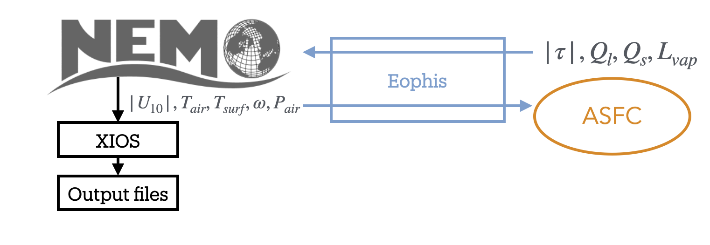
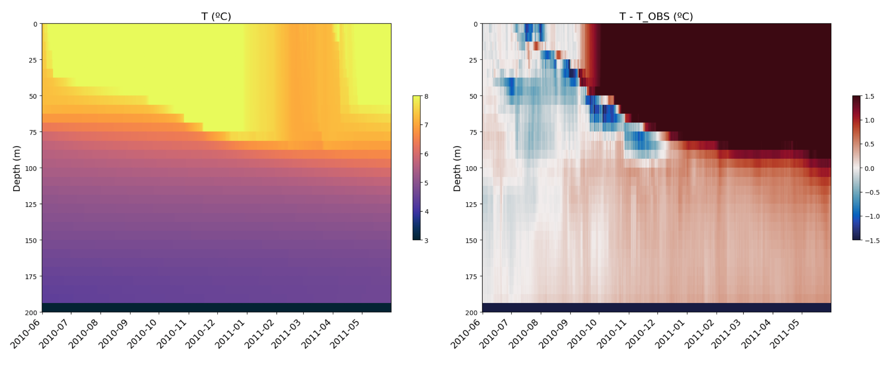

Tutorial: Create a Morays experiment for NEMO
=============================================

.. toctree::
   :maxdepth: 2

In this tutorial we will create a Morays experiment for NEMO from scratch. Objective is to deploy the Python software `AirSeaFluxCode <https://github.com/NOCSurfaceProcesses/AirSeaFluxCode>`_ (ASFC) developed by `Biri et al. 2023 <https://doi.org/10.3389/fmars.2022.1049168>`_ within the `C1D_PAPA <https://doi.org/10.5194/gmd-8-69-2015>`_ NEMO config.

Prerequisites to the turorial:
    - Operating NEMO environment with XIOS (see `NEMO doc <https://sites.nemo-ocean.io/user-guide/install.html>`_ for help)
    - Operating Python environment
    - Operating Morays environment (see `here <https://morays-doc.readthedocs.io/en/latest/nemo.getting_started.html#morays-environment>`_)
or:
    - Installed Apptainer
    - Morays container (see below)
    
    
**Apptainer on Linux**

.. code-block :: bash
    
    # For Ubuntu
    sudo apt update && sudo apt install -y software-properties-common
    sudo add-apt-repository -y ppa:apptainer/ppa
    sudo apt update && sudo apt install -y apptainer
    
    # For amd64 Debian
    sudo apt update
    sudo apt install -y wget
    cd /tmp
    wget https://github.com/apptainer/apptainer/releases/download/v1.4.3/apptainer_1.4.3_amd64.deb
    sudo apt install -y ./apptainer_1.4.3_amd64.deb
    
.. warning :: For other Linux distributions, please refer to this `guide <https://github.com/apptainer/apptainer/blob/main/INSTALL.md>`_.
 

**Apptainer on macOS**

.. code-block:: bash
    
    # Apptainer is available on macOS via LIMA (LInux virtual MAchines)
    brew install qemu lima  # Install with brew
    port install qemu lima  # Install with macports

    # Create Linux VM with Apptainer
    limactl start template://apptainer
    limactl shell apptainer
    # IMPORTANT: type 'cd' to go in VM home, 'pwd' should return '/home/<your_name>.linux'
    cd
    
    # NB1: copy files from VM to host
    limactl cp apptainer:/path/to/file  /host/destination
    

**Run Morays container**

.. code-block:: bash

    # Get your hardware architecture
    uname -m
    #  aarch64 --> arm64
    #  x86_64  --> amd64
    ARCH=arm64

    # Download image
    wget https://github.com/morays-community/morays-doc/releases/download/containers/morays_env_${ARCH}.sif

    # Run container: should print " >>>> Welcome in Morays environment ! <<<< "
    apptainer run --writable-tmpfs --bind $(pwd):/home/jdoe/morays_tutorial morays_env_${ARCH}.sif

        
        
Introduction
------------

C1D_PAPA is a 1D column NEMO configuration used to isolate and study vertical processes. It models turbulent-mixing behaviour over 1 year at Ocean Station PAPA, located in the North Pacific Ocean. For the tutorial, we will use a slightly modified version of the test case in which the vertical grid is regularly discretized on 32 depth levels over 200m, denoted hereafter as C1D_PAPA32.

ASFC is a package designed to allow easy exploration of different bulk formulae parameterizations. We wish to compute air-sea fluxes in NEMO with help of ASFC.
The latter is written with native Python libraries while NEMO is written in Fortran. Since NEMO has an OASIS interface, we can use the Eophis library to couple an external Python script that will contain ASFC model.

We arbitrarily choose an ASFC parameterization that takes wind speed module, potential air temperature, sea surface temperature, specific humidity and sea level pressure as inputs. Wind stress module, sensible, latent and vaporization heat are the outputs of the Python model.

The final experiment will execute the following steps:
    - NEMO is modeling C1D_PAPA32 turbulent mixing
    - It sends the inputs to a Python script that contains ASFC
    - ASFC computes air-sea fluxes from inputs
    - Results are sent back to NEMO and written in an output file with XIOS
    - Air-sea fluxes are used to compute surface boundary condition

1. Run standard C1D_PAPA32
--------------------------

We start by running standard C1D_PAPA32 without ASFC. Get a copy of NEMO v4.2.1:

.. code-block:: bash

    # Clone NEMO
    mkdir -p ~/morays_tutorial
    cd ~/morays_tutorial
    git clone --branch 4.2.1 https://forge.nemo-ocean.eu/nemo/nemo.git nemo_v4.2.1

Inputs, config material and arch file for C1D_PAPA32 are accessible in this repository:
    
.. code-block:: bash

    # Clone C1D_PAPA32
    cd ~/morays_tutorial/nemo_v4.2.1/cfgs/
    git clone https://github.com/alexis-barge/C1D_PAPA32.git

Build config:
    
.. code-block:: bash

    # Create C1D_PAPA32 test case
    cd ~/morays_tutorial/nemo_v4.2.1
    echo "C1D_PAPA32 OCE" >> cfgs/work_cfgs.txt
    
    # Compile -- adapt arch file if you are not running Morays container
    cp cfgs/C1D_PAPA32/arch-C1D_PAPA32_GCC.fcm   arch/
    ./makenemo -m "C1D_PAPA32_GCC" -r C1D_PAPA32 -j 3
    
    
and run NEMO:

.. code-block:: bash

    cd ~/morays_tutorial/nemo_v4.2.1/cfgs/C1D_PAPA32/EXP00
    ./nemo
    
You should find netcdf files ``C1D_PAPA32_1d_20100615_20110614_grid_<T,U,V,W>.nc`` when done. Scripts to plot profiles against time are provided:
 
.. code-block:: bash
 
    # Get plotting scripts and references
    cd ~/morays_tutorial/nemo_v4.2.1/cfgs/C1D_PAPA32/EXP00
    ln -s ../PLOTS/* .
 
    # Plot, you might need to exit container (and lima VM) to visualize figures
    python3 ./plots_res.py
    python3 ./plots_diff.py
 

.. image:: images/RES_C1D_PAPA32.png
    :width: 750px
    :align: center
 
 

2. Run ASFC model
-----------------

We have an operating NEMO configuration. Let's focus now on the ASFC model. As mentionned earlier, it must be written in an external Python script. ASFC code and an implementation of the model are provided in this repository:

.. code-block:: bash

    # Clone and install ASFC model
    cd ~/morays_tutorial/
    git clone https://github.com/TRACCS-COMPACT/AG2025-workshop-ocean-ml-coupling.git  ASFC
    cd ASFC/ASFC/AirSeaFluxCode/AirSeaFluxCode/
    pip install -e .

Edit ``~/morays_tutorial/ASFC/ASFC/models.py``, a function ``airseaflux()`` that takes numpy arrays for all required inputs is already defined. Those are passed in ``AirSeaFluxCode()`` in which air-sea fluxes are computed. Complete call of ``AirSeaFluxCode()`` as follows to use `Zeng et al. 1998 <https://journals.ametsoc.org/view/journals/clim/11/10/1520-0442_1998_011_2628_iobaaf_2.0.co_2.xml>`_ method and bulk formulation for sea surface temperature:

.. code-block:: python

        # compute Air Sea fluxes
        res = AirSeaFluxCode( wnd, tair, sst, "bulk", meth="UA", lat=np.array([50]), hum=['q', hum], P=slp, \
                              hin=10.0, maxiter=10, out_var = ( "tau", "latent", "sensible", "lv" )

Script ``models.py`` can be executed lonely with user-defined typical values as inputs (feel free to modify them). Run it to check that the model works correctly:

.. code-block :: bash

    python3 ./models.py
    # Should print:
    #   Returned tau shape: (1,1,1)
    #   tau: ... , tair: ...
    #   Test successful

.. note ::

    We have now an operating ASFC script. However, ``models.py`` does not possess an OASIS interface and cannot be coupled with NEMO. In the next sections, we will build the Eophis scripts and configure NEMO to set up the coupling.

3. Set up coupling environment
------------------------------

Time has come to install Eophis:

.. code-block :: bash

    # Clone and install Eophis_v1.0.1
    cd ~/morays_tutorial
    git clone --branch v1.0.1 https://github.com/meom-group/eophis eophis_v1.0.1
    cd eophis_v1.0.1
    pip install .

Define the exchanges
~~~~~~~~~~~~~~~~~~~~

An Eophis script is provided in the ASFC repository (``~/morays_tutorial/ASFC/ASFC/main.py``). The script may execute ``preproduction()`` or ``production()``. The first function is used to generate coupling material. The second one contains instructions to perform the coupling itself. For both, we need to define what we want to exchange in ``ocean_info()``:

Eophis needs to receive from NEMO:
    - surface fields ``wnd``, ``tair``, ``sst``, ``hum``, ``slp`` at each time step, on grid ``(1,1,1)``
and to send back results from ASFC:
    -  ``tau``, ``latent``, ``sensible``, ``evap`` at each time step, on grid ``(1,1,1)``

In Eophis, exchanges are defined in Tunnel. An empty Tunnel ``TO_NEMO`` (step 1) already exists:

.. code-block :: python

    tunnel_config = list()
    tunnel_config.append( { 'label' : 'TO_NEMO', \
                            'grids' : {}, \
                            'exchs' : [ {} ] }
                        )

Define the surface grid on which exchanges will be performed (i.e. 1 point grid):

.. code-block :: python

    tunnel_config = list()
    tunnel_config.append( { 'label' : 'TO_NEMO', \
                            'grids' : { 'C1D' : {'npts' : (1,1)} }, \
                            'exchs' : [ {} ] }
                        )

What remains is to define exchanges themselves. According to NEMO namelist, time step is ``1800s``. Following `Tunnel documentation <https://eophis.readthedocs.io/en/latest/usage.html#tunnel>`_, we can complete exchanges definition with:

.. code-block :: python

    tunnel_config = list()
    tunnel_config.append( { 'label' : 'TO_NEMO', \
                            'grids' : { 'C1D' : {'npts' : (1,1)} }, \
                            'exchs' : [ {'freq' : 1800, 'grd' : 'C1D', 'lvl' : 1, 'in' : ['wnd','tair','sst','hum','slp'], 'out' : ['tau','latent','sensible','evap']} ] }
                        )

The exchange line may be read as:

    every ``1800`` seconds, execute the receiving of field ``wnd``, ``tair``, ``sst``, ``hum``, ``slp`` and the sending back of fields ``tau``, ``latent``, ``sensible``, ``evap`` on the first level of grid ``C1D``.

Create Tunnel object (step 2) with:

.. code-block :: python

    to_nemo, = eophis.register_tunnels( tunnel_config )

Generate OASIS material
~~~~~~~~~~~~~~~~~~~~~~~

OASIS material is generated with ``write_coupling_namelist()``, which requires total simulation time as argument. This information is available in NEMO namelist ``namelist_cfg``. The latter is read and returned by ``ocean_info()``:

.. code-block :: python

    nemo_nml = eophis.FortranNamelist('~/morays_tutorial/nemo_v4.2.1/cfgs/C1D_PAPA32/EXPREF/namelist_cfg')
    
Thus, get namelist parameters (step 3) with:
    
.. code-block :: python

    step, it_end, it_0 = nemo_nml.get('rn_Dt','nn_itend','nn_it000')
    total_time = (it_end - it_0 + 1) * step

and use them to write OASIS namelist (step 4):

.. code-block :: python

    eophis.write_coupling_namelist( simulation_time=total_time )

Eophis preproduction script is ready to be executed:

.. code-block :: bash

    python3 ./main.py --exec preprod

Three files have been created: Eophis logs ``eophis.out``, ``eophis.err``, and ``namcouple``.

Connect models
~~~~~~~~~~~~~~

We complete function ``production()`` to drive exchanges all along the run. Since the Tunnel is already created, deploy the OASIS interface (step 5) with:

.. code-block :: python

    eophis.open_tunnels()

Coupling is effective. Fields can be received and used as arguments for ASFC. Import it (step 6):

.. code-block :: python

    from models import airseaflux
    
    
Exchanges must be synchronized in time, this is done by Loop. Loop requires a Tunnel to work with, number of time iteration, and time step value. Define Loop (step 7) as follows:

.. code-block :: python

    @eophis.all_in_all_out( geo_model=to_nemo, step=step, niter=niter )

Final step is to specify connexions between the exchanged data and ASFC. Connect received data, data to send and ASFC in ``loop_core()`` (step 8):

.. code-block :: python

    def loop_core(**inputs):
        """
        Content of loop_core is a Router. Connexions between exchanged variables and models are defined here.
        inputs dictionnary contains variables defined in Tunnel exchanges, and received by Eophis from NEMO.
        
        """
        packed_res = airseaflux( inputs['wnd'], inputs['tair'], inputs['sst'], inputs['hum'], inputs['slp'] )

        outputs= {}
        outputs['tau'], outputs['latent'], outputs['sensible'], outputs['evap'] = packed_res

        return outputs

We will now configure NEMO in accordance with coupling environment defined by Eophis.

4. Build C1D_PAPA32.ASFC
------------------------

OASIS-built NEMO
~~~~~~~~~~~~~~~~

C1D_PAPA32.ASFC models the same C1D_PAPA32 ocean circulation. Duplicate the case:

.. code-block:: bash

    # Create C1D_PAPA32.ASFC test case
    cd ~/morays_tutorial/nemo_v4.2.1/cfgs
    mkdir C1D_PAPA32.ASFC
    echo "C1D_PAPA32.ASFC OCE" >> work_cfgs.txt
    
    # Copy C1D_PAPA32 material
    cp -r C1D_PAPA32/EXPREF   C1D_PAPA32.ASFC/
    cp -r C1D_PAPA32/MY_SRC   C1D_PAPA32.ASFC/
    cp -r C1D_PAPA32/FORCING  C1D_PAPA32.ASFC/

and update experiment name in NEMO namelist:

.. code-block:: bash

    cd ~/morays_tutorial/nemo_v4.2.1/cfgs/C1D_PAPA32.ASFC/EXPREF
    vi namelist_cfg
        # ...
        cn_exp      = "C1D_PAPA32.ASFC" !  experience name
    
    
This configuration must be compatible with an OASIS build. OASIS interface in NEMO is activated by ``key_oasis3`` CPP key. We add it to those already used by C1D-PAPA32:

.. code-block:: bash

    # Create CPP key file
    echo " bld::tool::fppkeys   key_xios key_linssh key_oasis3" >> ~/morays_tutorial/nemo_v4.2.1/cfgs/C1D_PAPA32.ASFC/cpp_C1D_PAPA32.ASFC.fcm

OASIS and XIOS (compiled with OASIS) nmust be linked during NEMO compilation. Duplicate C1D_PAPA32 arch file and include them:

.. code-block :: bash

    # New arch file
    cd ~/morays_tutorial/nemo_v4.2.1/arch
    cp arch-C1D_PAPA32_GCC.fcm   arch-C1D_PAPA32_ASFC_GCC.fcm

    # Modify following lines: template is valid for Morays container
    vi arch-C1D_PAPA32_ASFC_GCC.fcm
        # ...
        %XIOS_HOME      /home/jdoe/XIOS_OASIS
        %OASIS_HOME     /home/jdoe/oasis3-mct/BLD
        # ...
        %OASIS_INC      -I%OASIS_HOME/include -I%OASIS_HOME/build-shared/lib/cbindings
        %OASIS_LIB      -L%OASIS_HOME/lib -loasis.cbind -lpsmile.MPI1 -lmct -lmpeu -lscrip
        # ...
        %USER_INC       %XIOS_INC %OASIS_INC %NCDF_INC
        %USER_LIB       %XIOS_LIB %OASIS_LIB %NCDF_LIB

Finally configure XIOS to be aware of OASIS environment:

.. code-block:: bash

    vi ~/morays_tutorial/nemo_v4.2.1/cfgs/C1D_PAPA32.ASFC/EXPREF/iodef.xml
        # ...
        <variable id="using_oasis"               type="bool">true</variable>

Minimal NEMO sources modifications are required to set up a hybrid Python-NEMO experiment. Those modifications are provided by Morays patch. It enables creation of independent OASIS modules. It can be obtained in this repository:

.. code-block :: bash

    # Get Morays patch
    cd ~/morays_tutorial/
    git clone https://github.com/morays-community/Patches-NEMO.git
    
We transfer Morays sources for NEMO_v4.2.1 OCE module to our case:

.. code-block :: bash

    cp ~/morays_tutorial/Patches-NEMO/NEMO_v4.2.1/OCE/*   ~/morays_tutorial/nemo_v4.2.1/cfgs/C1D_PAPA32.ASFC/MY_SRC/

.. warning ::

    For the tutorial, we will use a pre-defined version of Morays patch. Copy this extra file:
    
    .. code-block :: bash
    
        cp ~/morays_tutorial/ASFC/ASFC/infmod.F90   ~/morays_tutorial/nemo_v4.2.1/cfgs/C1D_PAPA32.ASFC/MY_SRC/

Configure NEMO
~~~~~~~~~~~~~~

Morays patch comes with a pre-defined communication module for Python that needs to be configured. Edit ``inffld.F90`` and allocate fields to store fields returned by ASFC:

.. code-block :: bash

    vi ~/morays_tutorial/nemo_v4.2.1/cfgs/C1D_PAPA32.ASFC/MY_SRC/inffld.F90

.. code-block :: Fortran
    
        ! Line 25
        REAL(wp), PUBLIC, ALLOCATABLE, SAVE, DIMENSION(:,:)  :: ext_sensible, ext_latent, ext_taum, ext_evap
        ! Line 42
        ALLOCATE( ext_taum(jpi,jpj), ext_latent(jpi,jpj), ext_sensible(jpi,jpj), ext_evap(jpi,jpj) , STAT=ierr )
        ! Line 56
        DEALLOCATE( ext_taum, ext_latent, ext_sensible, ext_evap  , STAT=ierr )

Python communication module is in ``infmod.F90``. Create IDs for the fields to exchange (step A), order does not matter:

.. code-block :: Fortran

   ! Fields to send -- jps_###
   INTEGER, PARAMETER ::   jps_wnd  = 1 ! Relative wind speed
   INTEGER, PARAMETER ::   jps_tair = 2 ! Potential air temperature
   INTEGER, PARAMETER ::   jps_sst  = 3 ! Sea surface temperature
   INTEGER, PARAMETER ::   jps_hum  = 4 ! Specific humidity
   INTEGER, PARAMETER ::   jps_slp  = 5 ! Sea level pressure
   INTEGER, PARAMETER ::   jps_inf = 5  ! total number of sendings

   ! Fields to receive -- jpr_###
   INTEGER, PARAMETER ::   jpr_lat = 1   ! Latent heat
   INTEGER, PARAMETER ::   jpr_sen = 2   ! Sensible heat
   INTEGER, PARAMETER ::   jpr_evp = 3   ! Vaporization heat
   INTEGER, PARAMETER ::   jpr_tau = 4   ! Wind stress
   INTEGER, PARAMETER ::   jpr_inf = 4   ! total number of receptions

Coupling properties for each field must be defined in ``inferences_init()`` subroutine. Let's focus on two of them that are initialized this way:

.. code-block :: Fortran

      ! Default properties for fields to receive
      srcv(ntypinf,:)%nlvl = 1  ;  srcv(ntypinf,:)%clname = ''
      
      ! Default properties for fields to send
      ssnd(ntypinf,:)%nlvl = 1  ;  ssnd(ntypinf,:)%clname = ''

First dimension of ``srcv`` and ``ssnd`` corresponds to module ID. Second dimension takes field IDs. ``nlvl`` is the number of depth level for 3D coupling, and ``clname`` is the alias under which OASIS will manipulate the field. Since only the surface level is required for all fields, we can keep the default value for ``nlvl``. Aliases are available in Eophis preproduction log ``eophis.out``:

.. code-block :: bash

    cat ~/morays_tutorial/ASFC/ASFC/eophis.out
        # [...]
        -------- Tunnel TO_NEMO_FIELDS registered --------
          namcouple variable names
            Earth side:
              - wnd -> E_OUT_0
              - tair -> E_OUT_1
              - sst -> E_OUT_2
              - hum -> E_OUT_3
              - slp -> E_OUT_4
              - tau -> E_IN_0
              - latent -> E_IN_1
              - sensible -> E_IN_2
              - evap -> E_IN_3

``wnd``, ``tair``, ``tau``... are manipulated by OASIS under ``E_OUT_0``, ``E_OUT_1``, ``E_IN_0``... respectively. Thus, finalize coupling configuration (step B) as follows:

.. code-block :: Fortran

         ! ssnd: Wind speed, Air Temperature, Specific humidity, Sea Surface Temperature, Sea level pressure
         ssnd(ntypinf,jps_wnd)%clname =  'E_OUT_0'
         ssnd(ntypinf,jps_tair)%clname = 'E_OUT_1'
         ssnd(ntypinf,jps_sst)%clname =  'E_OUT_2'
         ssnd(ntypinf,jps_hum)%clname =  'E_OUT_3'
         ssnd(ntypinf,jps_slp)%clname =  'E_OUT_4'

         ! srcv: Wind stress, latent heat, sensible heat, vaporization heat
         srcv(ntypinf,jpr_tau)%clname = 'E_IN_0'
         srcv(ntypinf,jpr_lat)%clname = 'E_IN_1'
         srcv(ntypinf,jpr_sen)%clname = 'E_IN_2'
         srcv(ntypinf,jpr_evp)%clname = 'E_IN_3'

Now we specify what values to send in ``inferences()`` subroutine. ``infsnd`` is a list of arrays whose indexes correspond to IDs of fields to send (``jps_``). We assume that NEMO fields containing values to send have been passed as arguments. Thus, fill ``infsnd`` with corresponding arrays (step C):

.. code-block :: Fortran

      ! ------  Prepare data to send ------
      !
      ! Wind speed
      infsnd(jps_wnd)%z3(:,:,ssnd(ntypinf,jps_wnd)%nlvl) = wndm(:,:)
      ! Air temperature
      infsnd(jps_tair)%z3(:,:,ssnd(ntypinf,jps_tair)%nlvl) = tair(:,:)
      ! SST - convert to Kelvin
      infsnd(jps_sst)%z3(:,:,ssnd(ntypinf,jps_sst)%nlvl) = sst(:,:) + 273.15_wp
      ! Specific humidity - convert to g/kg
      infsnd(jps_hum)%z3(:,:,ssnd(ntypinf,jps_hum)%nlvl) = hum(:,:) * 1000._wp
      ! Sea level pressure - convert to hPa
      infsnd(jps_slp)%z3(:,:,ssnd(ntypinf,jps_slp)%nlvl) = slp(:,:) * 0.01_wp

Sendings and receptions are already handled by this pre-defined communication module. Received fields are stored in ``infrcv``. It works like ``infsnd`` but with IDs of fields to receive (``jpr_``). Store results in the arrays we defined in ``inffld.F90`` (step D):

.. code-block :: Fortran

      ! ------ Distribute receptions  ------
      !
      ! Store latent, sensible, vaporization heat and wind stress
      ext_latent(:,:)   = infrcv(jpr_lat)%z3(:,:,srcv(ntypinf,jpr_lat)%nlvl)
      ext_sensible(:,:) = infrcv(jpr_sen)%z3(:,:,srcv(ntypinf,jpr_sen)%nlvl)
      ext_taum(:,:)     = infrcv(jpr_tau)%z3(:,:,srcv(ntypinf,jpr_tau)%nlvl)
      ext_evap(:,:)     = infrcv(jpr_evp)%z3(:,:,srcv(ntypinf,jpr_evp)%nlvl)

Communication module is configured. Import it in ``sbcblk.F90``:

.. code-block :: bash
    
    cp ~/morays_tutorial/nemo_v4.2.1/src/OCE/SBC/sbcblk.F90   ~/morays_tutorial/nemo_v4.2.1/cfgs/C1D_PAPA32.ASFC/MY_SRC/
    vi ~/morays_tutorial/nemo_v4.2.1/cfgs/C1D_PAPA32.ASFC/MY_SRC/sbcblk.F90

.. code-block :: Fortran

    ! Line 44
    44 USE inffld
    45 USE infmod

We call it after computation of NEMO bulk formula because all required fields are defined at this stage:

.. code-block :: Fortran

    ! Line 820
    CALL inferences( kt, SQRT(pwndi**2 + pwndj**2), ptair, pst, pssq, pslp )

and we overwrite NEMO fluxes with results from Python model:

.. code-block :: Fortran

    ! Line 824
    psen(:,:) = ext_sensible(:,:) * tmask(:,:,1)
    plat(:,:) = ext_latent(:,:) * tmask(:,:,1)
    taum(:,:) = ext_taum(:,:)  * tmask(:,:,1)
    pevp(:,:) = -1. * MAX(ext_latent(:,:),0.0_wp) / ext_evap(:,:) * tmask(:,:,1)

Finally build C1D_PAPA32.ASFC:

.. code-block :: bash

    # Compile
    cd ~/morays_tutorial/nemo_v4.2.1/
    ./makenemo -m "C1D_PAPA32_ASFC_GCC" -r C1D_PAPA32.ASFC -j 3
    

5. Run C1D_PAPA32.ASFC
----------------------

Complete C1D_PAPA32.ASFC config with Eophis and ASFC Python scripts:

.. code-block :: bash

    # Get Python material
    cp ~/morays_tutorial/ASFC/ASFC/*.py   ~/morays_tutorial/nemo_v4.2.1/cfgs/C1D_PAPA32.ASFC/EXP00

Copy ``namcouple`` as well, or re-execute Eophis preproduction in config. Run NEMO-Eophis:

.. code-block :: bash

    cd ~/morays_tutorial/nemo_v4.2.1/cfgs/C1D_PAPA32.ASFC/EXP00
    mpirun -np 1 ./nemo : -np 1 python3 ./main.py --exec prod

As for C1D_PAPA32, you should find some netcdf files. Use same scripts to plot results:

.. code-block:: bash
 
    # Get plotting scripts and references
    cd ~/morays_tutorial/nemo_v4.2.1/cfgs/C1D_PAPA32.ASFC/EXP00
    ln -s ../../C1D_PAPA32/PLOTS/* .
 
    # Plot, you might need to exit container (and lima VM) to visualize figures
    python3 ./plots_res.py
    python3 ./plots_diff.py
    
    

    
    
Try now to modify ASFC fluxes computation method in ``models.py`` and see the impacts on the results. See `ASFC documentation <https://github.com/NOCSurfaceProcesses/AirSeaFluxCode/blob/master/docs/Documentation.pdf>`_ for more help.

Going further
-------------

You have seen the minimal steps to set up a hybrid Python-NEMO experiment in Morays framework. We invite you to read `Eophis tutorial <https://eophis.readthedocs.io/en/latest/tutorial.html>`_ and `configuration guide for NEMO <https://morays-doc.readthedocs.io/en/latest/nemo.api_4.html>`_ to discover advanced coupling features.

If this tutorial helped you to build a new Morays experiment with NEMO, it would be greatly apreciated if you could `contribute to the Morays collection <https://morays-doc.readthedocs.io/en/latest/contribute.html>`_.
