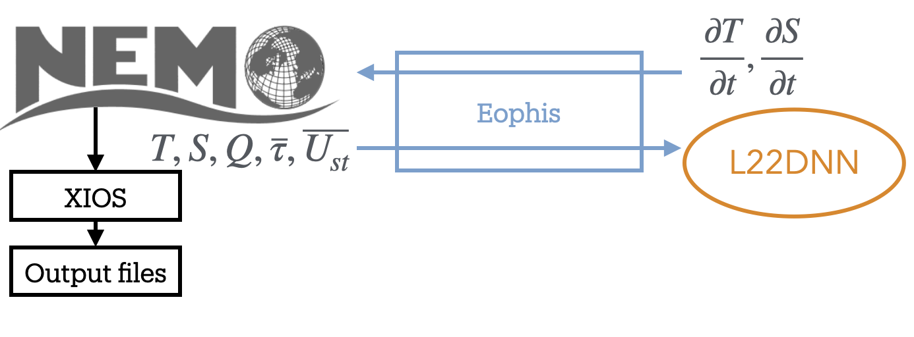

Tutorial: Create a Morays experiment for NEMO
=============================================

.. toctree::
   :maxdepth: 2

In this tutorial we will create a Morays experiment for NEMO from scratch. Objective is to deploy the Deep Neural Network (DNN) model proposed by `Liang et al. 2022 <https://doi.org/10.1016/j.ocemod.2022.102059>`_ (L22DNN) within the `C1D_PAPA <https://doi.org/10.5194/gmd-8-69-2015>`_ NEMO config.

Prerequisites to the turorial:
    - Operating NEMO environment with XIOS (see `NEMO doc <https://sites.nemo-ocean.io/user-guide/install.html>`_ for help)
    - Operating Python environment
    - Operating Morays environment (see `here <https://morays-doc.readthedocs.io/en/latest/nemo.getting_started.html#morays-environment>`_)
or:
    - Installed Apptainer
    - Morays container (see below)
    
    
**Apptainer on Linux**

.. code-block :: bash
    
    # Ubuntu
    # ------
    sudo apt update && sudo apt install -y software-properties-common
    sudo add-apt-repository -y ppa:apptainer/ppa
    sudo apt update && sudo apt install -y apptainer
    
    # Debian (amd64 ONLY)
    # -------------------
    cd /tmp
    wget https://github.com/apptainer/apptainer/releases/download/v1.3.6/apptainer_1.3.6_amd64.deb
    sudo apt install -y ./apptainer_1.3.6_amd64.deb
    
.. warning :: For other Linux distributions, please refer to this `guide <https://github.com/apptainer/apptainer/blob/main/INSTALL.md>`_.
 

**Apptainer on macOS**

.. code-block:: bash
    
    # Apptainer is available on macOS via LIMA (LInux virtual MAchines)
    brew install qemu lima  # Install with brew
    port install qemu lima  # Install with macports

    # Create Linux VM with Apptainer
    limactl start template://apptainer
    limactl shell apptainer
    
    # NB1: copy files from VM to host
    limactl cp apptainer:/path/to/file  /host/destination
    
    # NB2: remove VM on host after tutorial
    limactl stop apptainer
    rm -rf ~/.lima/apptainer

**Run Morays container**

.. code-block:: bash

    # Get your hardware architecture
    uname -m
    #  aarch64 --> arm64
    #  x86_64  --> amd64
    ARCH=arm64

    # Download image
    wget https://github.com/morays-community/morays-doc/releases/download/containers/morays_env_${ARCH}.sif

    # Run container
    apptainer run --writable-tmpfs --bind $(pwd):/home/jdoe/morays_tutorial morays_env_${ARCH}.sif

        
        
Introduction
------------

C1D_PAPA is a 1D column NEMO configuration used to isolate and study vertical processes. It models turbulent-mixing behaviour over 1 year at Ocean Station PAPA, located in the North Pacific Ocean. For the tutorial, we will use a slightly modified version of the test case in which the vertical grid is regurlaly discretized on 32 depth levels over 200m, denoted hereafter as C1D_PAPA32.

L22DNN takes place in the context of parameterizing vertical mixing in ocean surface boundary layer. The model takes vertical temperature, salinity and Stokes drift profiles, surface wind stress vector, and surface heat flux as inputs. Outputs of the model are the time derivatives due to turbulent mixing for temperature and salinity.

The DNN is written with native Python libraries while NEMO is written in Fortran. Since NEMO has an OASIS interface, we can use the Eophis library to couple an external Python script that will contain the L22DNN model.

The final experiment will execute the following steps:
    - NEMO is modeling C1D_PAPA32 turbulent mixing
    - It sends the inputs to a Python script that contains L22DNN
    - L22DNN infers mixing temperature and salinity time derivative
    - Results are sent back to NEMO and written in an output file with XIOS
    - Time derivatives are used to update temperature and salinity profiles

1. Run standard C1D_PAPA32
--------------------------

We start by running standard C1D_PAPA32 without L22DNN. Get a copy of NEMO v4.2.1:

.. code-block:: bash

    # Clone NEMO
    mkdir -p ~/morays_tutorial
    cd ~/morays_tutorial
    git clone --branch 4.2.1 https://forge.nemo-ocean.eu/nemo/nemo.git nemo_v4.2.1

Inputs, config material and arch file for C1D_PAPA32 are accessible in this repository:
    
.. code-block:: bash

    # Clone C1D_PAPA32
    cd ~/morays_tutorial/nemo_v4.2.1/cfgs/
    git clone https://github.com/alexis-barge/C1D_PAPA32.git

Build config:
    
.. code-block:: bash

    # Create C1D_PAPA32 test case
    cd ~/morays_tutorial/nemo_v4.2.1
    echo "C1D_PAPA32 OCE" >> cfgs/work_cfgs.txt
    
    # Compile -- adapt arch file if you are not running Morays container
    cp cfgs/C1D_PAPA32/arch-C1D_PAPA32_GCC.fcm   arch/
    ./makenemo -m "C1D_PAPA32_GCC" -r C1D_PAPA32 -n C1D_PAPA32
    
    
and run NEMO:

.. code-block:: bash

    cd ~/morays_tutorial/nemo_v4.2.1/cfgs/C1D_PAPA32/EXP00
    ./nemo
    
You should find netcdf files ``C1D_PAPA32_1d_20100615_20110614_grid_<T,U,V,W>.nc`` when done. Scripts to plot profiles against time are provided:
 
.. code-block:: bash
 
    # Get plotting scripts and references
    cd ~/morays_tutorial/nemo_v4.2.1/cfgs/C1D_PAPA32/EXP00
    ln -s ../PLOTS/* .
 
    # Plot, you might need to exit container (and lima VM) to visualize figures
    python3 ./plots_res.py
    python3 ./plots_diff.py
 

 

2. Run L22DNN Model
-------------------

We have an operating NEMO configuration. Let's focus now on the L22DNN model. As mentionned earlier, it must be written in an external Python script. Weights and trained model are provided in this repository:

.. code-block:: bash

    # Clone L22DNN model
    git clone https://github.com/alexis-barge/L22DNN.git   ~/morays_tutorial/L22DNN
    cd ~/morays_tutorial/L22DNN

Edit ``models.py``, an empty function ``L22DNN()`` that takes numpy arrays for all required inputs is already defined. Complete content of ``L22DNN()`` to convert inputs into compatible DNN format and outputs into numpy arrays, as specified in script header.

.. code-block:: python

    def L22DNN(T,S,Q,taux,tauy,stx,sty):
        if Is_None(T,S,Q,taux,tauy,sty,stx):
            return None, None
        else:
            global dnn
            # format inputs
            packed_inputs = ...
            packed_tensor = tf.convert_to_tensor(packed_inputs.astype('float32'))
            
            # predict
            preds = dnn(packed_tensor)
            
            # format outputs
            dTdt = preds["dense_4"].numpy()
            dSdt = preds["dense_4"].numpy()
            return dTdt, dSdt

DNN is loaded in ``load_model()`` during script initialization . Complete with weights path as follows:

.. code-block:: python

    def load_model(path=''):
        """ Load Tensor Flow model from keras-saved neural network """
        saved_model = tf.saved_model.load(path)
        dnn = saved_model.signatures["serving_default"]
        return dnn

Script ``models.py`` can be executed lonely with random arrays as inputs. Run it to check that the DNN works correctly:

.. code-block :: bash

    python3 ./models.py
    # Should print:
    #   Returned dTdt shape: (1,1,32)
    #   Test successful

.. note ::

    We have now an operating L22DNN script. However, ``models.py`` does not possess an OASIS interface and cannot be coupled with NEMO. In the next sections, we will build the Eophis scripts and configure NEMO to set up the coupling.

3. Set up coupling environment
------------------------------

Time has come to install Eophis:

.. code-block :: bash

    # Clone and install Eophis_v1.0.1
    cd ~/morays_tutorial
    git clone --branch v1.0.1 https://github.com/meom-group/eophis eophis_v1.0.1
    cd eophis_v1.0.1
    pip install .

Define the exchanges
~~~~~~~~~~~~~~~~~~~~

An Eophis script is provided in the L22DNN repository (``~/morays_tutorial/L22DNN/main.py``). The script may execute ``preproduction()`` or ``production()``. The first function is used to generate coupling material. The second one contains instructions to perform the coupling itself. For both, we need to define what we want to exchange in ``ocean_info()``:

Eophis needs to receive from NEMO:
    - whole profiles ``T``, ``S``, ``Stokes_x``, ``Stokes_y`` at each time step, on grid ``(1,1,32)``
    - surface fields ``Q``, ``Taux``, ``Tauy`` at each time step, on grid ``(1,1,1)``
and to send back results from L22DNN:
    -  ``dTdt``, ``dSdt``, at each time step, on grid ``(1,1,32)``

In Eophis, exchanges are defined in Tunnel. An empty Tunnel ``TO_NEMO`` (step 1) already exists:

.. code-block :: python

    tunnel_config = list()
    tunnel_config.append( { 'label' : 'TO_NEMO', \
                            'grids' : {}, \
                            'exchs' : [ {} ] }
                        )

Define the surface grid on which exchanges will be performed (i.e. 1 point grid):

.. code-block :: python

    tunnel_config = list()
    tunnel_config.append( { 'label' : 'TO_NEMO', \
                            'grids' : { 'C1D' : {'npts' : (1,1)} }, \
                            'exchs' : [ {} ] }
                        )

What remains is to define exchanges themselves. According to NEMO namelist, time step is ``1800s``. Following `Tunnel documentation <https://eophis.readthedocs.io/en/latest/usage.html#tunnel>`_, we can complete exchanges definition with:

.. code-block :: python

    tunnel_config = list()
    tunnel_config.append( { 'label' : 'TO_NEMO', \
                            'grids' : { 'C1D' : {'npts' : (1,1)} }, \
                            'exchs' : [ {'freq' : 1800, 'grd' : 'C1D' , 'lvl' : 32, 'in' : ['T','S','Stokes_x','Stokes_y'], 'out' : ['dTdt','dSdt'] }, \
                                        {'freq' : 1800, 'grd' : 'C1D' , 'lvl' : 1,  'in' : ['Q','TAUx','TAUy'], 'out' : [] } ] }
                        )

First exchange line may be read as:

    every ``1800`` seconds, execute the receiving of field ``T``, ``S``, ``Stokes_x``, ``Stokes_y`` and the sending back of fields ``dTdt``, ``dSdt`` on the first ``32`` levels of grid ``C1D``.

Create Tunnel object (step 2) with:

.. code-block :: python

    to_nemo, = eophis.register_tunnels( tunnel_config )

Generate OASIS material
~~~~~~~~~~~~~~~~~~~~~~~

OASIS material is generated with ``write_coupling_namelist()``, which requires total simulation time as argument. This information is available in NEMO namelist ``namelist_cfg``. The latter is read and returned by ``ocean_info()``:

.. code-block :: python

    nemo_nml = eophis.FortranNamelist(os.path.join(os.getcwd(),'namelist_cfg'))
    
Thus, get namelist parameters (step 3) with:
    
.. code-block :: python

    step, it_end, it_0 = nemo_nml.get('rn_Dt','nn_itend','nn_it000')
    total_time = (it_end - it_0 + 1) * step

and use them to write OASIS namelist (step 4):

.. code-block :: python

    eophis.write_coupling_namelist( simulation_time=total_time )

Eophis preproduction script is ready to be executed:

.. code-block :: bash

    python3 ./main.py --exec preprod

Three files have been created: Eophis logs ``eophis.out``, ``eophis.err``, and ``namcouple``.

Connect models
~~~~~~~~~~~~~~

We complete function ``production()`` to drive exchanges all along the run. Since the Tunnel is already created, deploy the OASIS interface (step 5) with:

.. code-block :: python

    eophis.open_tunnels()

Coupling is effective. Fields can be received and used as arguments for L22DNN. Import it (step 6):

.. code-block :: python

    from models import L22DNN
    
    
Exchanges must be synchronized in time, this is done by Loop. Loop requires a Tunnel to work with, number of time iteration, and time step value. Define Loop (step 7) as follows:

.. code-block :: python

    @eophis.all_in_all_out( geo_model=to_nemo, step=step, niter=niter )

Final step is to specify connexions between the exchanged data and L22DNN. Connect received data, data to send and L22DNN in ``loop_core()`` (step 8):

.. code-block :: python

    def loop_core(**inputs):
        """
        Content of loop_core is a Router. Connexions between exchanged variables and models are defined here.
        inputs dictionnary contains variables defined in Tunnel exchanges, and received by Eophis from NEMO.
        
        """
        outputs = {}
        outputs['dTdt'], outputs['dSdt'] = L22DNN( inputs['T'], inputs['S'], inputs['Q'], \
                                                   inputs['TAUx'], inputs['TAUy'],        \
                                                   inputs['Stokes_x'], inputs['Stokes_y'] \
                                                 )
        return outputs

We will now configure NEMO in accordance with coupling environment defined by Eophis.

4. Build C1D_PAPA32.L22DNN
--------------------------

OASIS-built NEMO
~~~~~~~~~~~~~~~~

C1D_PAPA32.L22DNN models the same C1D_PAPA32 ocean circulation. Duplicate the case:

.. code-block:: bash

    # Create C1D_PAPA32.L22DNN test case
    cd ~/morays_tutorial/nemo_v4.2.1/cfgs
    mkdir C1D_PAPA32.L22DNN
    echo "C1D_PAPA32.L22DNN OCE" >> work_cfgs.txt
    
    # Copy C1D_PAPA32 material
    cp -r C1D_PAPA32/EXPREF   C1D_PAPA32.L22DNN/
    cp -r C1D_PAPA32/MY_SRC   C1D_PAPA32.L22DNN/

and update experiment name in NEMO namelist:

.. code-block:: bash

    cd ~/morays_tutorial/nemo_v4.2.1/cfgs/C1D_PAPA32.L22DNN/EXPREF
    vi namelist_cfg
        # ...
        cn_exp      = "C1D_PAPA32.L22DNN" !  experience name
    
    
This configuration must be compatible with an OASIS build. OASIS interface in NEMO is activated by ``key_oasis3`` CPP key. We add it to those already used by C1D-PAPA32:

.. code-block:: bash

    # Create CPP key file
    echo " bld::tool::fppkeys   key_xios key_linssh key_oasis3" >> ~/morays_tutorial/nemo_v4.2.1/cfgs/C1D_PAPA32.L22DNN/cpp_C1D_PAPA32.L22DNN.fcm

OASIS and XIOS (compiled with OASIS) nmust be linked during NEMO compilation. Duplicate C1D_PAPA32 arch file and include them:

.. code-block :: bash

    # New arch file
    cd ~/morays_tutorial/nemo_v4.2.1/arch
    cp arch-C1D_PAPA32_GCC.fcm   arch-C1D_PAPA32_L22DNN_GCC.fcm

    # Modify following lines: template is valid for Morays container
    vi arch-C1D_PAPA32_L22DNN_GCC.fcm
        # ...
        %XIOS_HOME      /home/jdoe/XIOS_OASIS
        %OASIS_HOME     /home/jdoe/oasis3-mct/BLD
        # ...
        %OASIS_INC      -I%OASIS_HOME/include -I%OASIS_HOME/build-shared/lib/cbindings
        $OASIS_LIB      -L%OASIS_HOME/lib -loasis.cbind -lpsmile.MPI1 -lmct -lmpeu -lscrip
        # ...
        %USER_INC       %XIOS_INC %OASIS_INC %NCDF_INC
        %USER_LIB       %XIOS_LIB %OASIS_LIB %NCDF_LIB

Finally configure XIOS to be aware of OASIS environment:

.. code-block:: bash

    vi ~/morays_tutorial/nemo_v4.2.1/cfgs/C1D_PAPA32.L22DNN/EXPREF/iodef.xml
        # ...
        <variable id="using_oasis"               type="bool">true</variable>

Minimal NEMO sources modifications are required to set up a hybrid ML-NEMO experiment. Those modifications are provided by Morays patch. It enables creation of independent OASIS modules. It can be obtained in this repository:

.. code-block :: bash

    # Get Morays patch
    cd ~/morays_tutorial/
    git clone https://github.com/morays-community/Patches-NEMO.git
    
We transfer Morays sources for NEMO_v4.2.1 OCE module to our case:

.. code-block :: bash

    cp ~/morays_tutorial/Patches-NEMO/NEMO_v4.2.1/OCE/*   ~/morays_tutorial/nemo_v4.2.1/cfgs/C1D_PAPA32.L22DNN/MY_SRC/

Configure NEMO
~~~~~~~~~~~~~~

Morays patch comes with a pre-defined communication module for Python that needs to be configured. Edit ``inffld.f90`` and allocate fields to store time derivatives returned by L22DNN:

.. code-block :: bash

    vi ~/morays_tutorial/nemo_v4.2.1/cfgs/C1D_PAPA32.L22DNN/MY_SRC/inffld.f90

.. code-block :: Fortran
    
        ! Line 30
        REAL(wp), PUBLIC, ALLOCATABLE, SAVE, DIMENSION(:,:,:)  :: dTdt, dSdt
        ! Line 42
        ALLOCATE( dTdt(jpi,jpj,jpk), dSdt(jpi,jpj,jpk) , STAT=ierr )
        ! Line 56
        56 DEALLOCATE( dTdt, dSdt  , STAT=ierr )

Python communication module is in ``infmod.f90``. Create IDs for the fields to exchange (step A), order does not matter:

.. code-block :: Fortran

   ! Fields to send -- jps_###
   INTEGER, PARAMETER ::   jps_t = 1    ! sea temperature
   INTEGER, PARAMETER ::   jps_s = 2    ! sea salinity
   INTEGER, PARAMETER ::   jps_q  = 3   ! surface heat flux
   INTEGER, PARAMETER ::   jps_taux = 4 ! wind stress-x
   INTEGER, PARAMETER ::   jps_tauy = 5 ! wind stress-y
   INTEGER, PARAMETER ::   jps_stx = 6  ! Stokes Drift-x
   INTEGER, PARAMETER ::   jps_sty = 7  ! Stokes Drift-y
   INTEGER, PARAMETER ::   jps_inf = 7  ! total number of sendings for inferences

   ! Fields to receive -- jpr_###
   INTEGER, PARAMETER ::   jpr_dTdt = 1   ! dT/dt profile
   INTEGER, PARAMETER ::   jpr_dSdt = 2   ! dS/dt profile
   INTEGER, PARAMETER ::   jpr_inf = 2   ! total number of inference receptions

Coupling properties for each field must be defined in ``inferences_init()`` subroutine. Let's focus on two of them that are initialized this way:

.. code-block :: Fortran

      ! Default properties for fields to receive
      srcv(ntypinf,:)%nlvl = 1  ;  srcv(ntypinf,:)%clname = ''
      
      ! Default properties for fields to send
      ssnd(ntypinf,:)%nlvl = 1  ;  ssnd(ntypinf,:)%clname = ''

First dimension of ``srcv`` and ``ssnd`` corresponds to module ID. Second dimension takes field IDs. ``nlvl`` is the number of depth level for 3D coupling, and ``clname`` is the alias under which OASIS will manipulate the field. Aliases are available in Eophis preproduction log ``eophis.out``:

.. code-block :: bash

    cat ~/morays_tutorial/L22DNN/eophis.out
        # [...]
        -------- Tunnel TO_NEMO registered --------
          namcouple variable names
            Earth side:
              - T -> E_OUT_0
              - S -> E_OUT_1
              - Stokes_x -> E_OUT_2
              - Stokes_y -> E_OUT_3
              - dTdt -> E_IN_0
              - dSdT -> E_IN_1
              - Q -> E_OUT_4
              - TAUx -> E_OUT_5
              - TAUy -> E_OUT_6

``T``, ``S``, ``dTdt``... are manipulated by OASIS under ``E_OUT_0``, ``E_OU_1``, ``E_IN_0``... respectively. Thus, finalize coupling configuration (step B) as follows:

.. code-block :: Fortran

    ! sending of sea temperature
    ssnd(ntypinf,jps_t)%clname = 'E_OUT_0' ! OASIS name from Eophis log
    ssnd(ntypinf,jps_t)%nlvl = 32          ! 32 depth levels

    ! sending of sea salinity
    ssnd(ntypinf,jps_s)%clname = 'E_OUT_1'
    ssnd(ntypinf,jps_s)%nlvl = 32
    
    ! sending of Stokes drift-x
    ssnd(ntypinf,jps_stx)%clname = 'E_OUT_2'
    ssnd(ntypinf,jps_stx)%nlvl = 32

    ! sending of Stokes drift-y
    !!  use jps_sty, E_OUT_3 and 32 levels

    ! sending of surface heat flux
    ssnd(ntypinf,jps_q)%clname = 'E_OUT_4'  ! 1 depth level by default

    ! sending of wind stress-x
    !! ...

    ! sending of wind stress-y
    !! ...

    ! reception of temperature time derivative
    srcv(ntypinf,jpr_dTdt)%clname = 'E_IN_0'
    srcv(ntypinf,jpr_dTdt)%laction = .TRUE.
    srcv(ntypinf,jpr_dTdt)%nlvl = 32

    ! reception of salinity time derivative
    !!  use jpr_dSdt, E_IN_1 and 32 levels (in srcv !!)

Now we specify what values to send. Temperature and salinity arrays are in ``oce`` module. Heat flux and wind stresses come from ``sbc_oce``. We import them in ``infmod.f90`` header:

.. code-block :: Fortran
    
    USE oce     ! to get ts array
    USE sbc_oce ! to get qsr, qns, utau and vtau

``infsnd`` is a list of arrays whose indexes correspond to IDs of fields to send (``jps_``). Fill them with imported fields (step C). Stokes drifts are set to zero since we do not have wave model:

.. code-block :: Fortran

    ! sea Temperature
    infsnd(jps_t)%z3(:,:,1:ssnd(ntypinf,jps_t)%nlvl) = ts(:,:,1:ssnd(ntypinf,jps_t)%nlvl,jp_tem,Kmm)
    !
    ! sea Salinity
    infsnd(jps_s)%z3(:,:,1:ssnd(ntypinf,jps_s)%nlvl) = ts(:,:,1:ssnd(ntypinf,jps_s)%nlvl,jp_sal,Kmm)
    !
    ! surface heat flux
    infsnd(jps_q)%z3(:,:,ssnd(ntypinf,jps_q)%nlvl) = qsr(:,:) + qns(:,:)
    !
    ! wind stress
    infsnd(jps_taux)%z3(:,:,ssnd(ntypinf,jps_taux)%nlvl) = utau(:,:)
    infsnd(jps_tauy)%z3(:,:,ssnd(ntypinf,jps_tauy)%nlvl) = vtau(:,:)
    !
    ! Stokes Drift
    infsnd(jps_stx)%z3(:,:,1:ssnd(ntypinf,jps_stx)%nlvl) = 0.0
    infsnd(jps_sty)%z3(:,:,1:ssnd(ntypinf,jps_sty)%nlvl) = 0.0

Sendings and receptions are already handled by this pre-defined communication module. Received fields are stored in ``infrcv``. It works like ``infsnd`` but with IDs of fields to receive (``jpr_``). Store results in ``dTdt`` and ``dSdt`` arrays and output them (step D):

.. code-block :: Fortran

    ! Temperature and salinity time derivatives
    dTdt(:,:,1:srcv(ntypinf,jpr_dTdt)%nlvl) = infrcv(jpr_dTdt)%z3(:,:,1:srcv(ntypinf,jpr_dTdt)%nlvl)
    dSdt(:,:,1:srcv(ntypinf,jpr_dSdt)%nlvl) = infrcv(jpr_dSdt)%z3(:,:,1:srcv(ntypinf,jpr_dSdt)%nlvl)
    CALL iom_put( 'inf_dTdt', dTdt(:,:,:) )
    CALL iom_put( 'inf_dSdt', dSdt(:,:,:) )

Communication module is configured. Call it at the beginning of each time step in ``stpmlf.f90``:

.. code-block :: bash
    
    cp ~/morays_tutorial/nemo_v4.2.1/src/OCE/stpmlf.f90   ~/morays_tutorial/nemo_v4.2.1/cfgs/C1D_PAPA32.L22DNN/MY_SRC/
    vi ~/morays_tutorial/nemo_v4.2.1/cfgs/C1D_PAPA32.L22DNN/MY_SRC/stpmlf.f90

.. code-block :: Fortran

    167  CALL inferences ( kstp, Nbb, Nnn, Naa )

and use ``dTdt`` and ``dSdt`` for tracer advancement:

.. code-block :: bash
    
    cp ~/morays_tutorial/nemo_v4.2.1/src/OCE/TRA/... ~/morays_tutorial/nemo_v4.2.1/cfgs/C1D_PAPA32.L22DNN/MY_SRC/
    vi ~/morays_tutorial/nemo_v4.2.1/cfgs/C1D_PAPA32.L22DNN/MY_SRC/

.. code-block :: Fortran

    167  CALL inferences ( kstp, Nbb, Nnn, Naa )

        00 use inffld
        ! ...
        00   = dTdt(:,:,:)
        00   = dSdt(:,:,:)

Finally build C1D_PAPA32.L22DNN:

.. code-block :: bash

    # Compile
    cd ~/morays_tutorial/nemo_v4.2.1/
    ./makenemo -m "C1D_PAPA32_L22DNN_GCC" -r C1D_PAPA32.L22DNN -n C1D_PAPA32.L22DNN
    

5. Run C1D_PAPA32.L22DNN
------------------------

Complete C1D_PAPA32.L22DNN config with Eophis and L22DNN Python scripts:

.. code-block :: bash

    # Get Python material
    cp ~/morays_tutorial/L22DNN/*.py   ~/morays_tutorial/nemo_v4.2.1/cfgs/C1D_PAPA32.L22DNN/EXP00

Copy ``namcouple`` as well, or re-execute Eophis in preproduction mode. Run NEMO-Eophis:

.. code-block :: bash

    mpirun -np 1 ./nemo : -np 1 python3 ./main.py --exec prod

As for C1D_PAPA32, you should find some netcdf files. Use same scripts to plot results:

.. code-block:: bash
 
    # Get plotting scripts and references
    cd ~/morays_tutorial/nemo_v4.2.1/cfgs/C1D_PAPA32.L22DNN/EXP00
    ln -s ../../C1D_PAPA32/PLOTS/* .
 
    # Plot, you might need to exit container (and lima VM) to visualize figures
    python3 ./plots_res.py
    python3 ./plots_diff.py
    
    

Going further
-------------

You have seen the minimal steps to set up a hybrid ML-NEMO experiment in Morays framework. We invite you to read `Eophis documentation <https://eophis.readthedocs.io/en/latest/overview.html>`_ and `configuration guide for NEMO <https://morays-doc.readthedocs.io/en/latest/nemo.api_4.html>`_ to discover advanced coupling features.

If this tutorial helped you to build a new Morays experiment with NEMO, it would be greatly apreciated if you could `contribute to the Morays collection <https://morays-doc.readthedocs.io/en/latest/contribute.html>`_.
