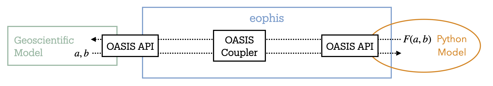

Morays
======

**M** imicking **O** cean **R** elevance with **A** rtificiall **Y** intelligent **S** nakes

`Morays`_ is a GitHub organization that provides a collection of deployment examples of the `Eophis`_ package in ocean models. It also proposes a solution for sharing the model experiments across centers. Our ambition is to offer a platform for fostering exchanges amongst Eophis users.

-------------------------------

`OASIS3-MCT`_ is a parallelized Fortran coupling library that performs field exchanges between coupled executables. Eophis is a Python library that facilitates the creation and the configuration of an OASIS3-MCT environment in a Python script to couple with Fortran/C geoscientific codes. It can be deployed with any geoscientific model if it does possess an OASIS3-MCT interface.

In this context, a Morays experiment is an ocean simulation in which the physical model sends fields towards an external Python script deployed by Eophis. The results computed by the Python model are sent back to the ocean and retroactively used for the solution.

Typical applications include:
    - Hybrid Machine Learning (ML) / Physics modeling
    - Deployment of fast evolving high-level libraries in stable low-level codes
    - Prototypal code testing

-------------------------------

Main purpose of this organization is to store examples of Morays experiments for different ocean models. So far, codes taken into consideration in this project are:

..

    - `NEMO`_
    - `CROCO`_ *(not started yet)*

-------------------------------

Every Morays experiments are documented in a self contained separate GitHub repository, that provides all the material for reproducing the use case. List of available experiments can be found in this `section <https://morays-doc.readthedocs.io/en/latest/morays_exp.html>`_. A last objective of this documentation is to give detailed guidelines to create custom Morays test cases.

.. note ::

    Newcomers are welcome to start with these tutorials:
        - `Reproduce Morays experiments with NEMO <https://morays-doc.readthedocs.io/en/latest/nemo.getting_started.html>`_
        - `Reproduce Morays experiments with CROCO <https://morays-doc.readthedocs.io/en/latest/croco.getting_started.html>`_

    People familiar with Eophis, ocean models or Morays framework are encouraged to follow these tutorials:
        - `Create Morays experiments with NEMO <https://morays-doc.readthedocs.io/en/latest/nemo.tuto.html>`_
        - `Create Morays experiments with CROCO <https://morays-doc.readthedocs.io/en/latest/croco.tuto.html>`_

    Advanced users can find advanced tools and informations in corresponding model sections:
        - `NEMO-Eophis <https://morays-doc.readthedocs.io/en/latest/nemo.html>`_
        - `CROCO-Eophis <https://morays-doc.readthedocs.io/en/latest/croco.html>`_

    People who wish to contribute to the Morays collection with their own experiments are invited to follow:
        - `Contribution guidelines <https://morays-doc.readthedocs.io/en/latest/contribute.html>`_

    
    

.. _Morays: https://github.com/morays-community
.. _Eophis: https://github.com/meom-group/eophis/
.. _OASIS3-MCT: https://oasis.cerfacs.fr/en/
.. _NEMO: https://www.nemo-ocean.eu/
.. _CROCO: https://www.croco-ocean.org/
